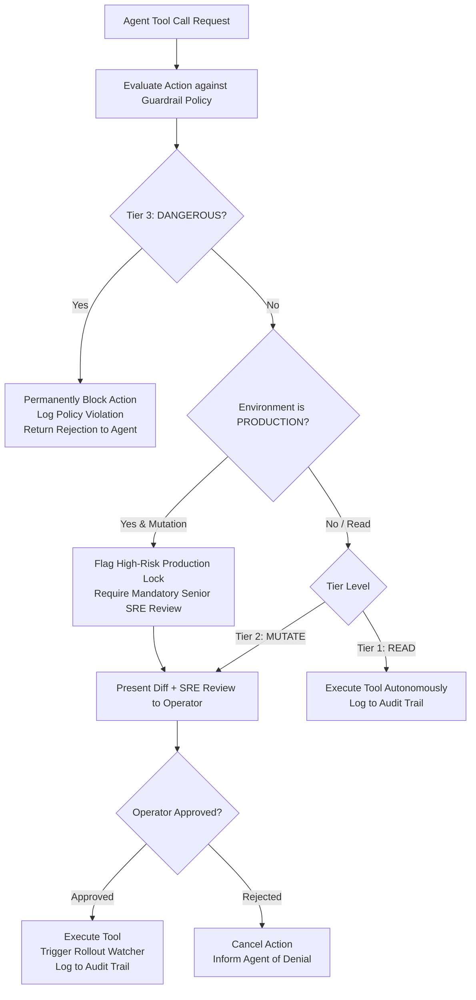

# Feature Spec 01: Progressive Safety Guardrails & 3-Tier Execution Policy

## 1. Overview & Objective
The **Progressive Safety Guardrails** subsystem provides the primary safety envelope for the Junior DevOps Agent. Autonomous agents operating in infrastructure environments carry inherent risks of accidental downtime, data loss, or cascading cluster failures. This subsystem enforces strict policy evaluation **before** any tool call or shell command can touch the underlying infrastructure.

## 2. Three-Tier Policy Classification
Every platform engineering action is classified deterministically into one of three tiers based on tool name, arguments, and cluster context:

| Tier | Category | Autonomy Level | Description | Examples |
| :--- | :--- | :--- | :--- | :--- |
| **Tier 1** | `READ` | **Autonomous** | Non-mutating queries, observability checks, file reads, and diagnostics. Executes immediately without human interruption. | `kubectl get pods`, `kubectl logs -p`, `az resource list`, `cert_expiry_check` |
| **Tier 2** | `MUTATE` | **Approval Required** | State-changing operations, workload restarts, manifest updates, scaling, and non-destructive mutations. Requires operator sign-off and SRE pre-flight review. | `kubectl rollout restart`, `gitops_create_pr`, `file_write`, `canary_deploy` |
| **Tier 3** | `DANGEROUS` | **Permanently Blocked** | High-blast-radius or irrecoverable operations. Blocked unconditionally at runtime with clear rejection feedback. | `kubectl delete namespace`, `az group delete`, `rm -rf /`, in-prod chaos drills |



## 3. Environment-Aware Production Lock
The subsystem continuously detects the active environment via context inspection:
- Cluster name check: matches `/prod/`, `/production/`, `/live/`.
- Environment variable check: `ENVIRONMENT=production`.
- When in production:
  - Any mutating action triggers `isProductionWarning = true`.
  - Mutation approvals require an explicit confirmation (`type 'yes' to confirm PRODUCTION mutation`).
  - Read-only diagnostics remain autonomous.

## 4. Key Data Interfaces & Types
Located in [`src/types.ts`](file:///Users/joshua.williams/Documents/research/junior-devops-agent/src/types.ts):
```typescript
export type ActionTier = 'READ' | 'MUTATE' | 'DANGEROUS';

export interface PolicyEvaluation {
  tier: ActionTier;
  actionSummary: string;
  reason: string;
  requiresApproval: boolean;
  isBlocked: boolean;
  isProductionWarning?: boolean;
}
```

## 5. Implementation Details
- **Policy Evaluator:** [`src/policy/guardrails.ts`](file:///Users/joshua.williams/Documents/research/junior-devops-agent/src/policy/guardrails.ts) - `Guardrails.evaluate(toolName, args, context)`.
- **Approval Handlers:** [`src/policy/approvals.ts`](file:///Users/joshua.williams/Documents/research/junior-devops-agent/src/policy/approvals.ts) - `CliApprovalHandler` provides color-coded CLI prompts displaying action summary, arguments, visual diff, and Senior SRE critique.

## 6. Edge Cases & Resilience
- **Regex Evasion Defense:** Commands like `kubectl delete ns` or `kubectl delete namespace default` are normalized before regex matching to prevent aliases or multi-argument tricks from bypassing Tier 3 blocks.
- **Operator Timeout:** Approvals in headless mode or webhook mode default to safe rejection if no response is received within timeout limits.

## 7. Verification & Tests
Verified in [`test/smoke.test.ts`](file:///Users/joshua.williams/Documents/research/junior-devops-agent/test/smoke.test.ts):
- Test 1: `kubectl get pods` passes autonomously as `READ`.
- Test 2: `kubectl rollout restart` requires operator approval as `MUTATE`.
- Test 3: Production mutation triggers `isProductionWarning`.
- Test 4: `kubectl delete namespace` is permanently blocked as `DANGEROUS`.
