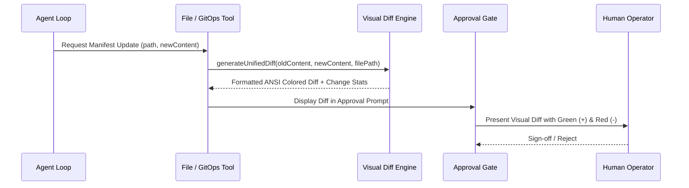

# Feature Spec 02: Visual Unified Diff Engine

## 1. Overview & Objective
The **Visual Unified Diff Engine** provides clear, line-by-line visual previews of proposed mutations before they are applied to Kubernetes clusters, Helm charts, Dockerfiles, or local infrastructure repositories. This prevents "blind applies" and ensures human operators can review exact configuration drift.

## 2. Capabilities
- **Line-by-Line Unified Diff:** Generates standard diff blocks comparing `oldContent` and `newContent`.
- **ANSI Color Terminal Output:**
  - Added lines (`+`) colored in bold green (`\x1b[32m`).
  - Removed lines (`-`) colored in bold red (`\x1b[31m`).
  - Header markers (`---`, `+++`, `@@`) formatted with distinct dim styling.
- **Context Boundaries:** Preserves surrounding contextual lines to give operators full visibility of where in the manifest changes occur.
- **Structured Drift Metadata:** Calculates added line count, removed line count, and overall mutation magnitude.



## 3. Data Interface & Implementation
Located in [`src/policy/diff.ts`](file:///Users/joshua.williams/Documents/research/devops-agent/src/policy/diff.ts):
```typescript
export interface DiffSummary {
  filePath: string;
  linesAdded: number;
  linesRemoved: number;
  unifiedDiff: string;
}

export class VisualDiffEngine {
  static generateDiff(oldContent: string, newContent: string, filePath: string): DiffSummary;
  static renderToTerminal(summary: DiffSummary): string;
}
```

## 4. Usage Patterns
1. **Manifest Edits:** When an agent updates resource requests/limits, image tags, or environment variables in a Kubernetes deployment manifest.
2. **GitOps Pull Requests:** Embedded in Git commit summaries and PR descriptions created via `gitops_create_pr`.
3. **ChatOps Notifications:** Embedded into Microsoft Teams Adaptive Cards, Slack Block Kit messages, and Discord embeds.

## 5. Verification & Tests
Verified in [`test/smoke.test.ts`](file:///Users/joshua.williams/Documents/research/devops-agent/test/smoke.test.ts):
- Test 5: Verifies that changing `replicas: 2` to `replicas: 5` produces a colorized diff with `+ replicas: 5` in green and `- replicas: 2` in red, with correct linesAdded/linesRemoved stats.
