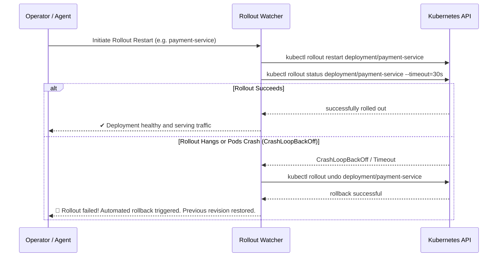

# Feature Spec 04: Rollout Watcher & Automated Rollback

## 1. Overview & Objective
When an AI agent restarts or updates a Kubernetes workload, human operators cannot afford to wait indefinitely or risk an unmonitored failure resulting in user-facing downtime. The **Rollout Watcher** provides post-mutation verification: it actively watches deployment rollout progress and automatically triggers an immediate `kubectl rollout undo` if the new pods fail to stabilize, crash in `CrashLoopBackOff`, or get stuck in `ImagePullBackOff`.

## 2. Architecture & Workflow


## 3. Data Interface & Implementation
Located in [`src/policy/watcher.ts`](file:///Users/joshua.williams/Documents/research/junior-devops-agent/src/policy/watcher.ts):
```typescript
export interface WatchResult {
  succeeded: boolean;
  rolledBack: boolean;
  message: string;
}

export class RolloutWatcher {
  static async watchAndVerify(
    name: string,
    kind: string = 'deployment',
    namespace?: string,
    timeoutSeconds: number = 30
  ): Promise<WatchResult>;

  static async rollback(name: string, kind: string = 'deployment', namespace?: string): Promise<string>;
}
```

## 4. Detection Logic
The watcher inspects stdout and stderr of rollout commands for standard Kubernetes failure signatures:
- `CrashLoopBackOff`
- `ImagePullBackOff` / `ErrImagePull`
- `CreateContainerConfigError`
- `timed out waiting for the condition`

When any failure signature is detected, `RolloutWatcher.rollback` is invoked immediately without waiting for human intervention, capping the blast radius of a bad release to seconds.

## 5. Integration Points
- **`k8s_rollout_restart` Tool:** Automatically chains `watchAndVerify` right after sending the restart command.
- **`k8s_watch_rollout` Tool:** Exposed as a standalone tool that the LLM agent can call after applying YAML manifests.
- **Canary Pipeline (`canary_deploy`):** Used during canary step promotions to verify pod stability before incrementing traffic weight.
