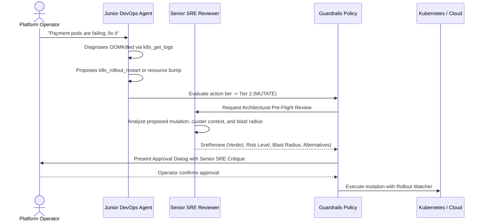

# Feature Spec 05: Senior SRE Pre-Flight Reviewer (Dual-Agent Collaboration)

## 1. Overview & Objective
Junior engineers frequently propose quick fixes that solve immediate symptoms but introduce architectural anti-patterns, cache stampedes, or cascading outages. The **Senior SRE Pre-Flight Reviewer** introduces a **Dual-Agent Architecture**: whenever the Junior DevOps agent proposes a Tier 2 mutating operation, a specialized Senior SRE agent automatically reviews the plan, generates an architectural critique, evaluates the blast radius, and provides recommendations **before** human operator sign-off.

## 2. Multi-Agent Review Flow


## 3. Data Interface & Schema
Located in [`src/harness/reviewer.ts`](file:///Users/joshua.williams/Documents/research/junior-devops-agent/src/harness/reviewer.ts):
```typescript
export interface SreReview {
  verdict: 'PROCEED' | 'CAUTION' | 'REJECT';
  riskLevel: 'LOW' | 'MEDIUM' | 'HIGH' | 'EXTREME';
  critique: string;
  blastRadiusAssessment: string;
  suggestedAlternatives: string[];
}

export class SeniorSreReviewer {
  constructor(llm: LLMClient);
  async review(
    policy: PolicyEvaluation,
    toolName: string,
    toolArgs: Record<string, any>,
    context: AgentContext
  ): Promise<SreReview>;
}
```

## 4. Architectural Checks Performed
1. **Blast Radius Analysis:** Will restarting this deployment drop in-flight transactions or cascade traffic to downstream databases?
2. **Production Severity:** In production contexts, does this violate peak-hours change freeze policies or require a GitOps Pull Request instead of an in-place mutation?
3. **Root Cause Alignment:** Is a restart simply masking a memory leak that will recur in 30 minutes?
4. **Resilient Fallback:** When running offline or if LLM calls timeout, an algorithmic rule engine synthesizes a high-fidelity pre-flight critique based on resource types and environment tier.

## 5. Verification & Tests
Verified in [`test/smoke.test.ts`](file:///Users/joshua.williams/Documents/research/junior-devops-agent/test/smoke.test.ts):
- Test 11: Validates that `SeniorSreReviewer.review()` generates risk assessments, critiques, and alternatives for workload mutations.
