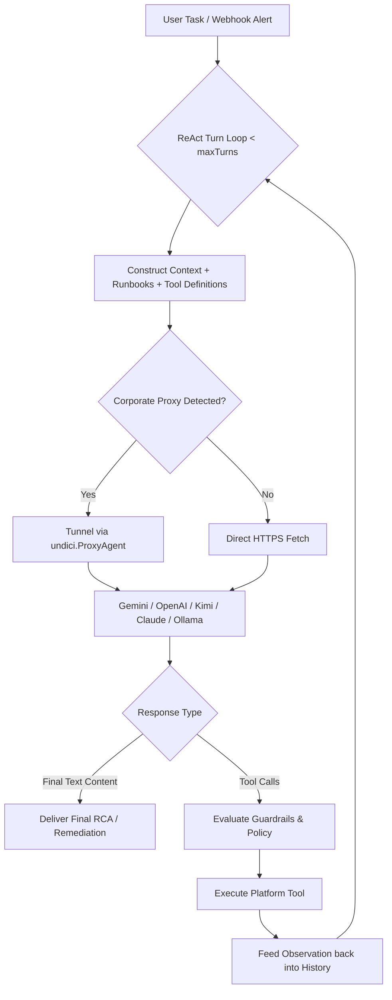

# Feature Spec 06: ReAct Agent Loop & Multi-Provider LLM Harness

## 1. Overview & Objective
The **ReAct Agent Loop & LLM Harness** serves as the central brain of the platform. It orchestrates iterative **Reasoning (Thought) -> Tool Execution (Action) -> Environment Feedback (Observation)** loops to resolve complex platform engineering tasks. It abstracts multi-provider LLM communication behind a unified interface with corporate proxy support and built-in offline diagnostic fallbacks.

## 2. Multi-Provider Architecture
The harness supports 5 distinct LLM backends via [`src/harness/llm.ts`](file:///Users/joshua.williams/Documents/research/devops-agent/src/harness/llm.ts):

| Provider | Model Examples | Tool Calling Protocol | Protocol Description |
| :--- | :--- | :--- | :--- |
| **Google Gemini** | `gemini-2.5-flash`, `gemini-2.5-pro` | Native `functionDeclarations` | REST API with schema declarations |
| **OpenAI** | `gpt-4o`, `gpt-4o-mini` | `tools` / `function` | Standard OpenAI Chat Completions API |
| **Kimi (Moonshot)** | `moonshot-v1-auto`, `moonshot-v1-32k` | OpenAI Compatible | High-context Chinese/English reasoning |
| **Anthropic** | `claude-3-7-sonnet`, `claude-3-5-sonnet` | Anthropic `tool_use` / `tool_result` | Native Messages API with content blocks |
| **Local Ollama** | `llama3:8b`, `qwen2.5-coder:7b` | OpenAI Compatible | 100% air-gapped, offline execution |

## 3. Corporate Proxy Tunneling
Enterprise clusters frequently reside behind authenticating or non-authenticating forward HTTP/HTTPS proxies. The harness automatically detects `http_proxy` / `https_proxy` from the environment, normalizes missing protocols, and routes outbound LLM API requests through `undici.ProxyAgent`.



## 4. Offline Diagnostic Fallback & Direct Routing
To prevent failures when an API key is missing, expired, or invalid:
1. Direct slash commands (`/certs`, `/finops`, `/security`, `/topology`, `/runbooks`, `/tools`, `/audit`, `/kb`) execute their deterministic TypeScript tools immediately.
2. Natural language tasks matching known diagnostic patterns (e.g. "Check for expiring TLS certificates") route to the corresponding tool directly.
3. If an unconfigured LLM key is detected for arbitrary tasks, the engine returns an interactive configuration guide rather than failing with an unhandled exception.
4. If an LLM run executes tools but produces no final text block, the harness synthesizes a complete diagnostic report from the executed tool outputs.

## 5. Key Interfaces
Located in [`src/harness/loop.ts`](file:///Users/joshua.williams/Documents/research/devops-agent/src/harness/loop.ts):
```typescript
export interface AgentRunOptions {
  task: string;
  sessionId?: string;
  maxTurns?: number;
  approvalHandler?: ApprovalHandler;
  onTextChunk?: (text: string) => void;
  onToolStart?: (name: string, args: any) => void;
  onToolEnd?: (name: string, output: string) => void;
}

export class DevOpsAgentHarness {
  constructor(llm: LLMClient, context: AgentContext, auditLogger?: AuditLogger);
  async run(options: AgentRunOptions): Promise<string>;
}
```
