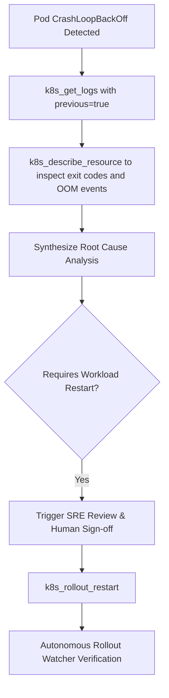

# Feature Spec 07: Kubernetes Cluster Operations

## 1. Overview & Objective
The **Kubernetes Cluster Operations** subsystem provides high-level, structured tools enabling the agent to inspect, diagnose, and manage workloads in any standard Kubernetes or managed AKS/EKS/GKE cluster. It abstracts `kubectl` commands into structured tool schemas with strict parameter validation and safety integration.

## 2. Implemented Tools & Capabilities
Located in [`src/tools/k8s.ts`](file:///Users/joshua.williams/Documents/research/junior-devops-agent/src/tools/k8s.ts):

| Tool Name | Action Tier | Description | Key Parameters |
| :--- | :--- | :--- | :--- |
| **`k8s_get_resources`** | `READ` | Query resources (pods, deployments, services, ingress, nodes, events). Omit namespace to query all namespaces (`-A`). | `resource`, `namespace?`, `labelSelector?` |
| **`k8s_describe_resource`** | `READ` | Inspect resource events, state, exit codes, and conditions. | `resource`, `name`, `namespace?` |
| **`k8s_get_logs`** | `READ` | Stream pod container stdout/stderr. Supports `--previous` (`-p`) to inspect why a crashed pod exited before restarting. | `podName`, `namespace?`, `container?`, `tailLines?`, `previous?` |
| **`k8s_rollout_restart`** | `MUTATE` | Trigger rolling restart of a deployment, daemonset, or statefulset. Automatically watches health and rolls back if pods fail. | `name`, `kind?`, `namespace?` |
| **`k8s_watch_rollout`** | `READ` | Explicitly monitor rollout progression and verify zero-downtime stabilization. | `name`, `kind?`, `namespace?`, `timeoutSeconds?` |

## 3. Crash Diagnostics with Previous Logs (`-p`)
When pods crash in `CrashLoopBackOff`, querying active logs often returns nothing or an empty string because the new container hasn't started yet. `k8s_get_logs` provides first-class support for `previous: true` (`kubectl logs -p`), which captures the exact stack trace, panic, or unhandled exception that caused the previous instance to terminate.

## 4. Safety Constraints
- Broad queries (`k8s_get_resources` across all namespaces) are allowed for read-only visibility.
- Workload mutations are strictly governed by Tier 2 approval rules and cannot run silently without operator consent.
- Namespace deletion and cluster-wide resource purges are blocked at the guardrails layer.

## 5. Verification & Tests
Verified in [`test/smoke.test.ts`](file:///Users/joshua.williams/Documents/research/junior-devops-agent/test/smoke.test.ts):
- Test 1: `k8s_get_resources` passes policy check autonomously.
- Test 2: `k8s_rollout_restart` triggers approval request and SRE pre-flight review.
