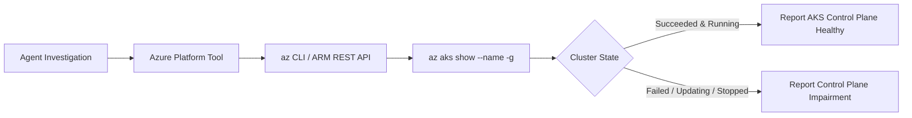

# Feature Spec 08: Azure Cloud & AKS Operations

## 1. Overview & Objective
Modern enterprise DevOps workflows frequently operate on managed cloud Kubernetes services like Azure Kubernetes Service (AKS). The **Azure Cloud & AKS Operations** subsystem provides native cloud provider diagnostics, querying Azure Resource Manager (ARM) via the Azure CLI (`az`) to inspect cluster provisioning states, node pool capacity, and resource groups.

## 2. Implemented Tools
Located in [`src/tools/azure.ts`](file:///Users/joshua.williams/Documents/research/devops-agent/src/tools/azure.ts):

| Tool Name | Action Tier | Description | Key Parameters |
| :--- | :--- | :--- | :--- |
| **`az_resource_list`** | `READ` | List cloud resources in an Azure resource group or filter by resource type. | `resourceGroup?`, `resourceType?` |
| **`az_aks_status`** | `READ` | Query AKS cluster status, provisioning state, power state, FQDN, and node pool health. | `clusterName`, `resourceGroup` |

## 3. Data Extracted from AKS
When `az_aks_status` is called, the tool parses the ARM JSON response and extracts:
- `provisioningState`: e.g. `Succeeded`, `Failed`, `Updating`.
- `powerState`: e.g. `Running`, `Stopped`.
- `kubernetesVersion`: Cluster control plane version.
- `agentPoolProfiles`: Node count, VM SKU size, OS disk size, and provisioning state of worker pools.
- `networkProfile`: Network plugin (Azure CNI vs Kubenet), outbound type, and load balancer SKU.

## 4. Safety Constraints
- Read-only diagnostics run autonomously.
- Any shell commands attempting destructive actions (e.g. `az group delete`, `az aks delete`) are permanently blocked by Tier 3 guardrails.
- Timeout protection prevents hanging if Azure credentials are expired.
