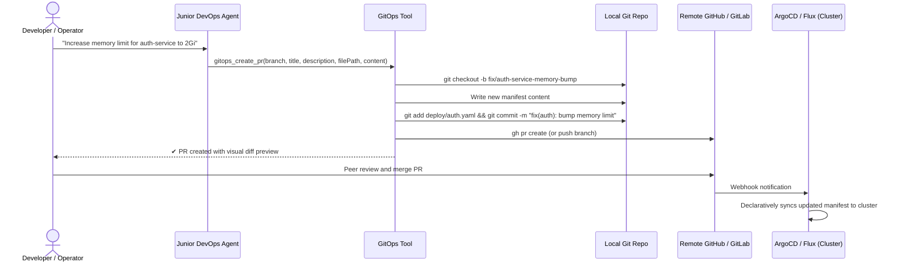

# Feature Spec 09: GitOps Pull Request Automation

## 1. Overview & Objective
In mature infrastructure organizations, direct mutations against live clusters (`kubectl apply` or `kubectl edit`) are considered anti-patterns that create unversioned configuration drift. The **GitOps Pull Request Automation** subsystem enables the Junior DevOps Agent to practice GitOps discipline: instead of directly altering the cluster, it creates an isolated Git branch, commits declarative manifest changes with an explanatory message, and opens a reviewable Pull Request.

## 2. Architecture & Workflow


## 3. Data Interface & Schema
Located in [`src/tools/gitops.ts`](file:///Users/joshua.williams/Documents/research/junior-devops-agent/src/tools/gitops.ts):
```typescript
export interface CreatePROptions {
  branchName: string;
  title: string;
  description: string;
  filePath: string;
  newContent: string;
}

export class GitOpsTool {
  static async createPR(options: CreatePROptions): Promise<string>;
}
```

## 4. Operational Guardrails
- **Tier 2 Mutation:** Opening a GitOps branch and modifying files requires human operator approval before execution.
- **Visual Diff Integration:** The tool incorporates the `VisualDiffEngine` to display a colorized diff of the changes being committed in the PR description.
- **GitHub CLI Fallback:** If GitHub CLI (`gh`) is authenticated, it runs `gh pr create --title ... --body ...`. If not authenticated, it creates the branch locally and outputs exact `git push origin <branch>` and Web URL instructions.
