# Feature Spec 10: Incident Postmortems & Knowledge Base Memory

## 1. Overview & Objective
When incidents occur, organizations suffer from "institutional amnesia" where identical outages are diagnosed and solved from scratch repeatedly. The **Incident Postmortems & Knowledge Base Memory** subsystem enables the agent to:
1. Standardize and generate structured Root Cause Analysis (RCA) postmortem reports immediately upon resolving an incident.
2. Persist postmortems to disk under `.postmortems/`.
3. Search and reference past incident history during active triage to apply proven remediations rapidly.

## 2. Architecture & Workflow

```mermaid
flowchart TD
    subgraph Incident Resolution Phase
        Fix[Issue Resolved on Cluster] --> PostmortemTool[generate_postmortem_report]
        PostmortemTool --> Markdown[Format Standard RCA Markdown]
        Markdown --> SaveDisk[Persist to .postmortems/incident-<id>.md]
    end

    subgraph Future Incident Triage Phase
        NewAlert[New Alert: 504 Gateway Timeout] --> KBSearch[knowledge_base_search]
        KBSearch --> QueryDisk[Scan .postmortems/ for Similar Keywords]
        QueryDisk --> Match[Match: Database Connection Starvation]
        Match --> ProvenFix[Apply Known Fix: Increase HikariCP Pool Size]
    end
```


## 3. Data Interface & Schema
Located in [`src/tools/postmortem.ts`](file:///Users/joshua.williams/Documents/research/junior-devops-agent/src/tools/postmortem.ts):
```typescript
export interface PostmortemData {
  incidentTitle: string;
  severity: 'SEV-1' | 'SEV-2' | 'SEV-3' | 'SEV-4';
  affectedServices: string[];
  symptom: string;
  rootCause: string;
  remediation: string;
  preventionItems: string[];
  startTime?: string;
  resolvedTime?: string;
}

export class PostmortemTool {
  static async generate(data: PostmortemData): Promise<string>;
  static async searchKnowledgeBase(query: string): Promise<string>;
}
```

## 4. Standard RCA Postmortem Format
Reports generated by the tool follow Google SRE best practices:
- **Header:** Incident Title, Severity Badge, Timestamp, Duration.
- **Executive Summary:** High-level summary of customer impact.
- **Affected Workloads:** Pods, namespaces, and services impacted.
- **Root Cause Analysis (RCA):** Deep technical explanation of the breakdown.
- **Remediation & Recovery:** Immediate fix steps taken.
- **Preventative Action Items:** Concrete backlog items to prevent recurrence.

## 5. Verification & Tests
Verified in [`test/smoke.test.ts`](file:///Users/joshua.williams/Documents/research/junior-devops-agent/test/smoke.test.ts):
- Test 8: Verifies markdown postmortem generation with structured RCA sections.
- Test 9: Verifies that searching the knowledge base returns relevant past postmortems.
