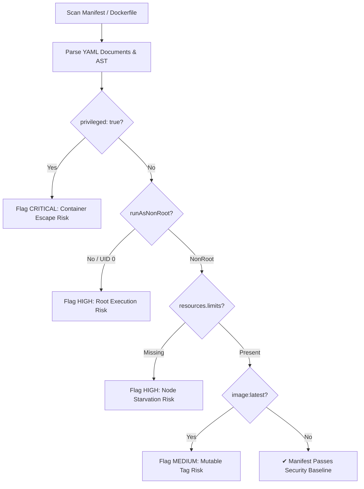

# Feature Spec 11: Security & Manifest Static Linter

## 1. Overview & Objective
Deploying insecure manifests into production clusters introduces container escape vectors, node starvation risks, and non-deterministic image deployments. The **Security & Manifest Static Linter** inspects Kubernetes YAML manifests and Dockerfiles before they are applied, auditing for platform security violations and container hardening standards.

## 2. Security Violations Audited
Located in [`src/tools/security.ts`](file:///Users/joshua.williams/Documents/research/devops-agent/src/tools/security.ts):

| Security Check | Severity | Rationale | Remediation Recommendation |
| :--- | :--- | :--- | :--- |
| **Privileged Container** | `CRITICAL` | `securityContext.privileged: true` grants root capabilities over the host node. | Remove `privileged: true` and specify only required Linux capabilities (`capAdd`). |
| **Root User Execution** | `HIGH` | Containers running as UID 0 can compromise host systems if a breakout occurs. | Set `runAsNonRoot: true` and specify `runAsUser: 10001`. |
| **Mutable `:latest` Tag** | `MEDIUM` | Pulling `:latest` creates non-reproducible builds and breaks rollback predictability. | Pin container images to specific semantic versions or immutable SHA256 digests. |
| **Missing Resource Limits** | `HIGH` | Pods without CPU/Memory limits can cause node Out-Of-Memory (OOM) kernel panics. | Configure `resources.requests` and `resources.limits` for both memory and CPU. |
| **Writable Root Filesystem** | `LOW` | Read-write filesystems allow attackers to write malicious payloads inside pods. | Set `readOnlyRootFilesystem: true` and use `emptyDir` mounts for temp caches. |



## 3. Data Interface & Schema
```typescript
export interface SecurityFinding {
  file: string;
  resource: string;
  severity: 'CRITICAL' | 'HIGH' | 'MEDIUM' | 'LOW';
  rule: string;
  description: string;
  recommendation: string;
}

export class SecurityLinterTool {
  static async scan(targetPath?: string): Promise<string>;
}
```

## 4. Usage Patterns
- **Pre-Commit / Pre-PR:** Triggered automatically by the agent before submitting a GitOps Pull Request.
- **On-Demand Audit:** Executed via CLI command `/security` or Web Console Quick Action "Audit cluster security posture".
- **Admission Gate:** Can be combined with the Senior SRE Reviewer to block deployment approval if any `CRITICAL` security findings are detected.

## 5. Verification & Tests
Verified in [`test/smoke.test.ts`](file:///Users/joshua.williams/Documents/research/devops-agent/test/smoke.test.ts):
- Test 10: Validates that manifests with `privileged: true` or `:latest` tags are correctly flagged with actionable remediations.
