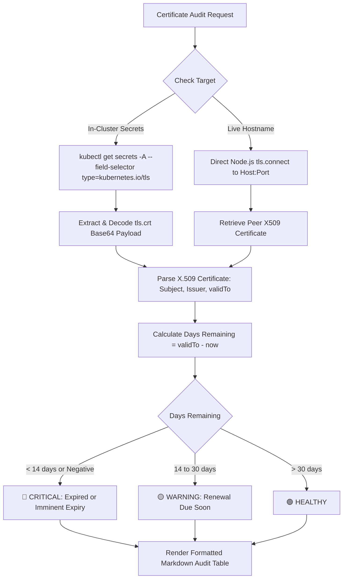

# Feature Spec 12: TLS Certificate Sentinel & Expiry Checker

## 1. Overview & Objective
Expired TLS/SSL certificates are a leading cause of severe, sudden outages in production web services, API gateways, and in-cluster mTLS mesh communication. The **TLS Certificate Sentinel** scans in-cluster Kubernetes TLS secrets and live external endpoints, inspecting X.509 certificate metadata to alert teams to expiring or expired certificates before customers encounter browser security warnings.

## 2. Architecture & Inspection Flow


## 3. Data Interface & Schema
Located in [`src/tools/certificates.ts`](file:///Users/joshua.williams/Documents/research/devops-agent/src/tools/certificates.ts):
```typescript
export interface CertStatus {
  name: string;             // Secret namespace/name or hostname
  issuer: string;           // Certificate Authority (e.g. Let's Encrypt, DigiCert)
  subject: string;          // Common Name (CN) / Subject Alternative Names
  validTo: string;          // ISO Date string
  daysRemaining: number;    // Calculated calendar days
  status: 'CRITICAL' | 'WARNING' | 'HEALTHY';
}

export class CertExpiryTool {
  static async check(options: {
    namespace?: string;
    hostname?: string;
    port?: number;
  }): Promise<string>;
}
```

## 4. Key Capabilities & Enterprise Handling
- **Negative Days Detection:** Certificates that expired in the past display exact negative day counts (e.g. `-152 days`) to aid clean-up of stale secrets.
- **Large-Cluster Streaming:** Compatible with clusters containing hundreds of TLS secrets across multi-tenant namespaces without payload truncation or memory exhaustion.
- **Offline / Autonomous Execution:** Accessible via CLI `/certs` and the Web Console Quick Action without requiring an active LLM provider.
