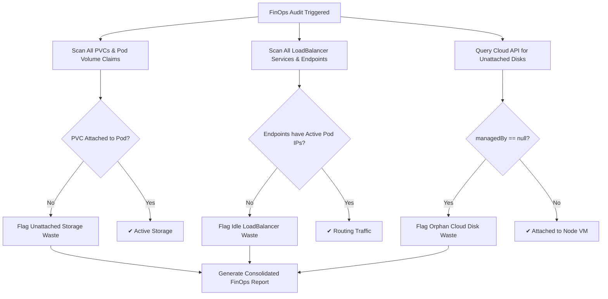

# Feature Spec 13: FinOps Waste & Idle Cloud Resource Hunter

## 1. Overview & Objective
Cloud waste accounts for 30–35% of enterprise cloud spend according to industry benchmarks. Unattached persistent volume claims (PVCs), decommissioned load balancers, and orphaned cloud disks accumulate quietly over months. The **FinOps Waste & Idle Cloud Resource Hunter** autonomously audits cluster storage, networking, and cloud provider resources to identify orphaned assets and recommend cost-saving remediation.

## 2. Waste Detection Vectors
Located in [`src/tools/finops.ts`](file:///Users/joshua.williams/Documents/research/junior-devops-agent/src/tools/finops.ts):

| Waste Category | Detection Logic | Financial Impact | Recommended Action |
| :--- | :--- | :--- | :--- |
| **Unattached PVCs** | PVCs marked `Bound` whose claim names are not referenced by any running pod volume in the namespace. | Unused Azure Managed Disks / AWS EBS volumes incurring monthly GB storage fees. | Verify if persistent data is obsolete; take backup snapshot and delete PVC. |
| **Idle LoadBalancers** | Services with `type: LoadBalancer` that have no active pod IP endpoints receiving traffic in `kubectl get endpoints`. | Cloud providers charge ~$18–$25/month per provisioned cloud load balancer IP. | Remove obsolete service or correct pod selector labels to restore traffic routing. |
| **Orphan Cloud Disks** | Azure managed disks queried via `az disk list` where `managedBy == null`. | Storage fees accrued on unattached disk blocks disconnected from decommissioned VMs. | Archive snapshot to cold blob storage and delete unattached disk. |



## 3. Data Interface & Schema
```typescript
export interface FinOpsFinding {
  resource: string;
  category: 'Unattached Storage' | 'Idle LoadBalancer' | 'Orphan Cloud Disk' | 'Over-Provisioned';
  detail: string;
  recommendation: string;
}

export class FinOpsTool {
  static async audit(namespace?: string): Promise<string>;
}
```

## 4. Performance & Scalability
- **Batch Endpoint Queries:** Queries all endpoints in a single `kubectl get endpoints -o json` call instead of issuing N serial requests, enabling instant audits across large multi-tenant clusters.
- **Graceful Cloud Timeout:** Azure CLI calls enforce a 4-second timeout to ensure the audit runs smoothly even in environments without active Azure CLI subscriptions.
- **Access Points:** Accessible via CLI `/finops` command, Web Console Quick Action, and autonomous tool call `finops_idle_resources_audit`.
