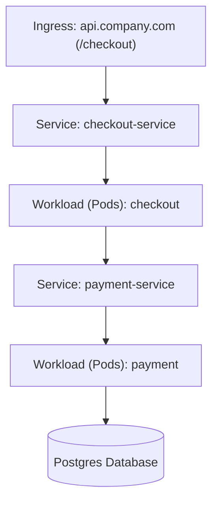

# Feature Spec 14: Service Dependency Topology & Blast-Radius Mapping

## 1. Overview & Objective
When incidents strike or mutating actions are proposed, operators need an immediate visual map of upstream ingress paths, service meshes, and downstream dependencies. The **Service Dependency Topology & Blast-Radius Mapping** subsystem discovers live cluster relationships and generates standard Mermaid graph diagrams with dependency blast-radius calculations.

## 2. Discovery Mechanism
Located in [`src/tools/topology.ts`](file:///Users/joshua.williams/Documents/research/junior-devops-agent/src/tools/topology.ts):
1. **Ingress Discovery:** Extracts host rules, paths, and backend service targets from all cluster Ingress manifests.
2. **Service-to-Workload Mapping:** Queries Kubernetes Services, parsing label selectors (`app`, `app.kubernetes.io/name`) to connect services with underlying container deployments.
3. **Storage & Database Heuristics:** Identifies relational and caching stores (PostgreSQL, MySQL, MongoDB, Redis) and draws data-layer persistence nodes.
4. **Mermaid Graph Generation:** Synthesizes an interactive `graph TD` diagram renderable directly in GitHub markdown, documentation artifacts, and web dashboards.



## 3. Data Interface & Schema
```typescript
export interface TopologyNode {
  name: string;
  type: 'Ingress' | 'Service' | 'Pod' | 'Database' | 'External';
  namespace: string;
  targets: string[];
}

export class TopologyTool {
  static async discover(namespace?: string): Promise<string>;
}
```

## 4. Blast-Radius Assessment
For any target workload, the subsystem calculates:
- **Upstream Callers:** Services that depend on this workload to respond to external traffic.
- **Downstream Dependencies:** Caching, database, and message brokers that could be affected if the workload crashes or enters a retry loop.
- **SRE Pre-Flight Review Integration:** Supplies concrete blast-radius data to the Senior SRE Reviewer when evaluating restart or scaling actions.

## 5. Verification & Tests
Verified in [`test/smoke.test.ts`](file:///Users/joshua.williams/Documents/research/junior-devops-agent/test/smoke.test.ts):
- Test 13: Validates that `TopologyTool.discover()` generates a valid Mermaid `graph TD` dependency map.
