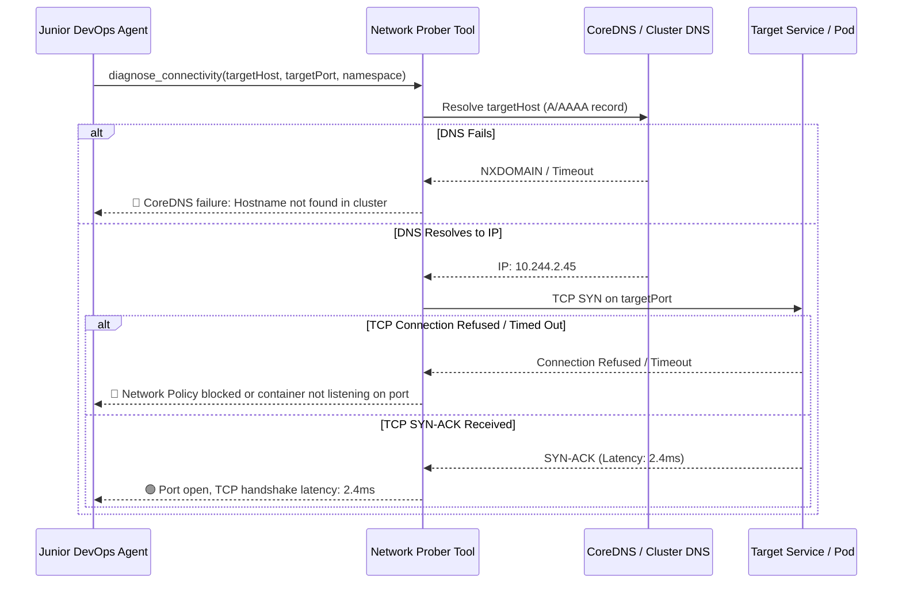

# Feature Spec 15: In-Cluster Network Connectivity Prober

## 1. Overview & Objective
Inter-service network communication failures, DNS lookup timeouts via CoreDNS, and firewall/NetworkPolicy misconfigurations are notoriously difficult to debug. The **In-Cluster Network Connectivity Prober** conducts synthetic network diagnostics, verifying DNS name resolution, TCP socket reachability, and HTTP response latencies between services.

## 2. Diagnostic Steps & Flow
Located in [`src/tools/network.ts`](file:///Users/joshua.williams/Documents/research/devops-agent/src/tools/network.ts):

1. **DNS Resolution Check:** Attempts to resolve the target hostname (e.g. `redis.default.svc.cluster.local`) to an IP address, validating CoreDNS functionality.
2. **TCP Three-Way Handshake:** Initiates a low-level TCP socket connection with millisecond latency instrumentation.
3. **HTTP Protocol Probe:** If testing a web port (e.g. 80, 443, 8080), sends an HTTP probe to inspect HTTP status codes and TLS handshake timing.



## 3. Data Interface & Schema
```typescript
export interface NetworkProbeResult {
  target: string;
  port: number;
  dnsSuccess: boolean;
  resolvedIp?: string;
  tcpSuccess: boolean;
  latencyMs?: number;
  error?: string;
}

export class NetworkProberTool {
  static async probe(targetHost: string, targetPort: number = 80, namespace?: string): Promise<string>;
}
```

## 4. Common Triaged Scenarios
- **CoreDNS Starvation:** Differentiates between application crashes and cluster DNS lookup timeouts.
- **Port Misalignment:** Detects when a Kubernetes Service specifies `targetPort: 8080` while the container is listening on port `3000`.
- **Calico / Cilium NetworkPolicies:** Pinpoints when pod-to-pod network traffic is rejected by security policies.

## 5. Verification & Tests
Verified in [`test/smoke.test.ts`](file:///Users/joshua.williams/Documents/research/devops-agent/test/smoke.test.ts):
- Test 14: Validates TCP and DNS resolution test execution with formatted latency metrics.
