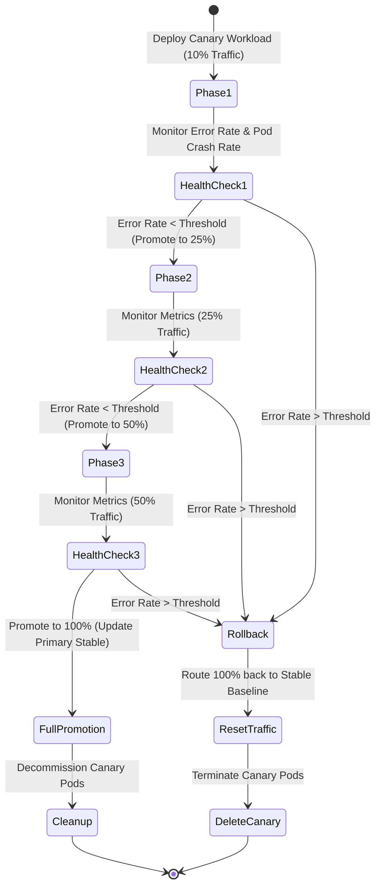

# Feature Spec 16: Automated Canary Release Pipeline

## 1. Overview & Objective
Deploying new container images directly to 100% of traffic can cause widespread user-facing outages if unhandled runtime regressions exist. The **Automated Canary Release Pipeline** executes progressive traffic-shifted deployments (e.g. 10% -> 25% -> 50% -> 100%), continuously monitoring error rates and health metrics at each phase, and automatically rolling back traffic if anomalies occur.

## 2. Progressive Stepping Workflow
Located in [`src/tools/canary.ts`](file:///Users/joshua.williams/Documents/research/junior-devops-agent/src/tools/canary.ts):



## 3. Data Interface & Schema
```typescript
export interface CanaryOptions {
  serviceName: string;
  imageTag: string;
  namespace?: string;
  initialWeight?: number;        // Default: 10 (%)
  maxErrorRate?: number;         // Default: 1.0 (%)
  stepDurationSeconds?: number;  // Default: 10 (s)
}

export class CanaryTool {
  static async deploy(options: CanaryOptions): Promise<string>;
}
```

## 4. Verification & Rollback Triggers
At each traffic promotion step:
1. **Error Rate Spike:** Evaluates synthetic or Prometheus 5xx error percentage.
2. **Crash Monitoring:** Uses the `RolloutWatcher` to verify that canary pods don't enter `CrashLoopBackOff`.
3. **Automated Abort:** If any metric breaches thresholds, traffic weight is immediately shifted 100% back to the stable primary deployment and canary pods are safely terminated.

## 5. Safety Policy Integration
- Executing a canary deployment changes live cluster routing and is classified as **Tier 2 (MUTATE)**, requiring operator confirmation and a Senior SRE pre-flight critique before initiation.
