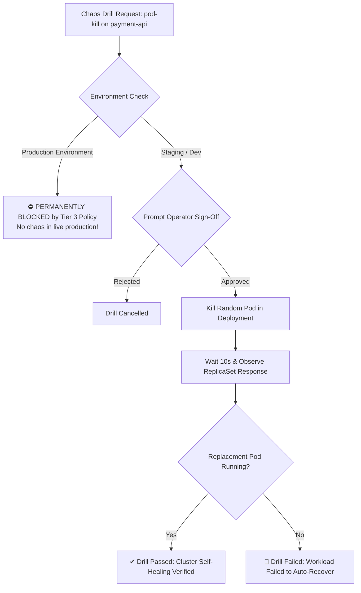

# Feature Spec 17: Chaos Engineering Drill Engine

## 1. Overview & Objective
Resilient architectures must survive node terminations, sudden pod crashes, and network latency spikes without impacting end-user availability. The **Chaos Engineering Drill Engine** provides controlled, deliberate failure injection in non-production environments to test Kubernetes self-healing and alert pipeline triggering.

## 2. Supported Chaos Experiments
Located in [`src/tools/chaos.ts`](file:///Users/joshua.williams/Documents/research/junior-devops-agent/src/tools/chaos.ts):

| Experiment Action | Mechanism | Validated Behavior |
| :--- | :--- | :--- |
| **`pod-kill`** | Terminates an active pod belonging to the target workload deployment. | Tests whether Kubernetes Deployment/ReplicaSet controller immediately launches a healthy replacement pod. |
| **`latency-inject`** | Introduces artificial TCP network delays on the target workload's port. | Tests client retry policies, circuit breakers, and upstream timeout configurations. |
| **`cpu-stress`** | Generates synthetic CPU load on worker pods. | Tests Horizontal Pod Autoscaling (HPA) triggers and resource limit governance. |

## 3. Strict Safety Interlocking
- **Production Hard Block:** Executing any chaos experiment in a cluster detected as `production` (or `ENVIRONMENT=production`) is **unconditionally blocked** as a Tier 3 `DANGEROUS` action.
- **Operator Verification:** In staging and development environments, drills require Tier 2 `MUTATE` human sign-off with blast-radius visibility.

## 4. Verification & Tests
Verified in [`test/smoke.test.ts`](file:///Users/joshua.williams/Documents/research/junior-devops-agent/test/smoke.test.ts):
- Test 15: Validates that chaos drills in `production` are strictly `BLOCKED` with a Tier 3 verdict, while drills in `development` require standard human approval.
