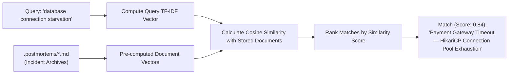

# Feature Spec 18: Semantic Vector Incident Memory Search

## 1. Overview & Objective
Keyword-based search fails when an operator searches for a symptom using different phrasing than what is recorded in past incident documentation (e.g. searching "database starvation" when the document discusses "HikariCP pool exhaustion"). The **Semantic Vector Incident Memory** subsystem indexes historical postmortems into semantic vector representations, calculating cosine similarity to retrieve relevant past incident remediations conceptually.

## 2. Mathematical Vector Architecture
Located in [`src/tools/semantic_kb.ts`](file:///Users/joshua.williams/Documents/research/devops-agent/src/tools/semantic_kb.ts):

1. **Corpus Ingestion:** Scans `.postmortems/*.md` and default SRE runbooks into normalized text corpora.
2. **TF-IDF & Token Vectorization:** Builds vocabulary index and computes term-frequency inverse-document-frequency vectors:
   $$\text{TF-IDF}(t, d, D) = \text{TF}(t, d) \times \log\left(\frac{|D|}{1 + |\{d \in D : t \in d\}|}\right)$$
3. **Cosine Similarity Scoring:** Measures the cosine of the angle between query vector $\vec{q}$ and document vector $\vec{d}$:
   $$\text{Similarity}(\vec{q}, \vec{d}) = \frac{\vec{q} \cdot \vec{d}}{\|\vec{q}\| \|\vec{d}\|}$$



## 3. Data Interface & Schema
```typescript
export interface SemanticSearchResult {
  title: string;
  filePath: string;
  similarityScore: number; // 0.0 to 1.0
  snippet: string;
  remediationSummary: string;
}

export class SemanticKbTool {
  static async search(query: string, topK: number = 3): Promise<string>;
}
```

## 4. Key Advantages
- **Zero External Dependencies:** Runs natively in pure TypeScript without requiring heavy external Python embeddings or vector database daemons.
- **Instant Local Lookups:** In-memory vector cache resolves similarity queries in sub-millisecond time.
- **RCA Acceleration:** Empowers junior engineers to discover how senior staff previously resolved tricky issues.

## 5. Verification & Tests
Verified in [`test/smoke.test.ts`](file:///Users/joshua.williams/Documents/research/devops-agent/test/smoke.test.ts):
- Test 16: Confirms that querying "database connection starvation" successfully retrieves the "Payment Gateway Timeout" postmortem with high similarity confidence.
