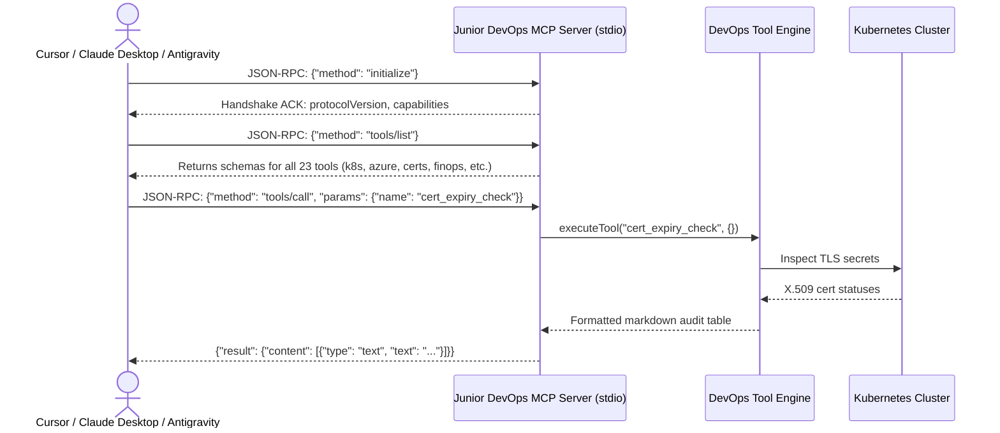

# Feature Spec 20: Model Context Protocol (MCP) Server & Client Hub

## 1. Overview & Objective
The **Model Context Protocol (MCP)** is an open JSON-RPC standard that enables AI models and IDEs (such as Claude Desktop, Cursor, and Antigravity) to discover and invoke tools in external environments securely. The **MCP Server & Client Hub** allows the Junior DevOps Agent to function both as an **MCP Server** (exposing all 23 DevOps tools over stdio) and an **MCP Client** (consuming third-party tools from external sidecars).

## 2. JSON-RPC Protocol Architecture
Located in [`src/mcp/server.ts`](file:///Users/joshua.williams/Documents/research/junior-devops-agent/src/mcp/server.ts) and [`src/mcp/client.ts`](file:///Users/joshua.williams/Documents/research/junior-devops-agent/src/mcp/client.ts):



## 3. Supported Methods
- **`initialize`:** Returns server protocol version and capability flags (`tools`).
- **`tools/list`:** Returns JSON Schema specifications for all registered platform tools.
- **`tools/call`:** Dispatches tool execution through the guardrail policy and returns structured text content blocks.

## 4. IDE Integration Guide
To expose this DevOps agent directly to Claude Desktop or Cursor, add the following configuration to `claude_desktop_config.json` or cursor MCP settings:

```json
{
  "mcpServers": {
    "junior-devops-agent": {
      "command": "node",
      "args": [
        "/Users/joshua.williams/Documents/research/junior-devops-agent/dist/index.js",
        "--mcp"
      ]
    }
  }
}
```

## 5. Verification & Tests
Verified in [`test/smoke.test.ts`](file:///Users/joshua.williams/Documents/research/junior-devops-agent/test/smoke.test.ts):
- Test 12: Validates JSON-RPC `initialize` handshake and verifies that `tools/list` exposes all platform engineering tools over stdio.
