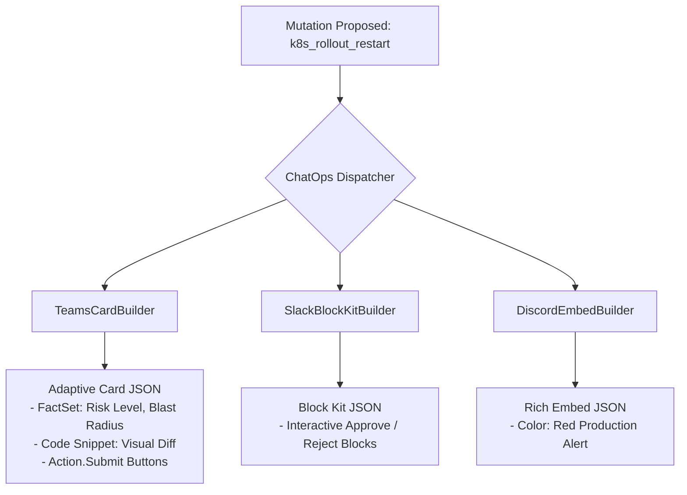

# Feature Spec 21: Enterprise ChatOps Notification Adapters

## 1. Overview & Objective
Modern engineering teams conduct collaborative incident response and release sign-offs in team communication channels. The **Enterprise ChatOps Notification Adapters** subsystem formats SRE pre-flight reviews, safety guardrail warnings, and approval requests into rich, interactive payloads for **Microsoft Teams**, **Slack**, and **Discord**.

## 2. Multi-Platform Support
Located in [`src/adapters/`](file:///Users/joshua.williams/Documents/research/junior-devops-agent/src/adapters/):

| Platform | Adapter Class | Payload Technology | Key Interactive Features |
| :--- | :--- | :--- | :--- |
| **Microsoft Teams** | `TeamsCardBuilder` | Adaptive Cards v1.4 | `Action.Submit` buttons, FactSets, visual diff blocks, and SRE risk badges. |
| **Slack** | `SlackBlockKitBuilder` | Slack Block Kit | `section`, `divider`, and `actions` blocks with green `primary` (Approve) and red `danger` (Reject) buttons. |
| **Discord** | `DiscordEmbedBuilder` | Discord Rich Embeds | Hex-coded color warning banners (`0xff0000` for prod, `0x3b82f6` for dev) and field matrices. |



## 3. Data Interface & Schema
Located across [`src/adapters/teams.ts`](file:///Users/joshua.williams/Documents/research/junior-devops-agent/src/adapters/teams.ts), [`src/adapters/slack.ts`](file:///Users/joshua.williams/Documents/research/junior-devops-agent/src/adapters/slack.ts), and [`src/adapters/discord.ts`](file:///Users/joshua.williams/Documents/research/junior-devops-agent/src/adapters/discord.ts):
```typescript
// Teams Adaptive Card Generator
export class TeamsCardBuilder {
  static buildApprovalCard(
    policy: PolicyEvaluation,
    toolName: string,
    toolArgs: Record<string, any>,
    requestId: string,
    sreReview?: SreReview,
    diff?: DiffSummary
  ): Record<string, any>;
}

// Slack Block Kit Generator
export class SlackBlockKitBuilder {
  static buildApprovalBlocks(
    policy: PolicyEvaluation,
    toolName: string,
    toolArgs: Record<string, any>,
    requestId: string,
    sreReview?: SreReview
  ): { blocks: any[] };
}

// Discord Rich Embed Generator
export class DiscordEmbedBuilder {
  static buildApprovalEmbed(
    policy: PolicyEvaluation,
    toolName: string,
    toolArgs: Record<string, any>,
    sreReview?: SreReview
  ): { embeds: any[] };
}
```

## 4. Verification & Tests
Verified in [`test/smoke.test.ts`](file:///Users/joshua.williams/Documents/research/junior-devops-agent/test/smoke.test.ts):
- Test 11: Validates Microsoft Teams Adaptive Card schema generation.
- Test 17: Validates Slack Block Kit button layout and Discord embed color styling.
