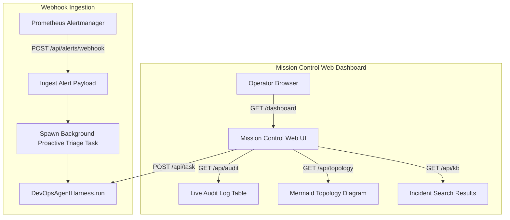

# Feature Spec 22: Mission Control Web Console & Alert Webhook Server

## 1. Overview & Objective
The **Mission Control Web Console & Alert Webhook Server** serves as the graphical management and observability interface for the Junior DevOps Agent. It provides:
1. A real-time, browser-based DevOps terminal emulator with Quick Action buttons.
2. Ingestion webhooks for Prometheus Alertmanager, Azure Monitor, and PagerDuty to launch autonomous incident triage.
3. Live visualization of audit logs, cluster topology, and historical RCA incident postmortems.

## 2. Server Architecture & Endpoints
Located in [`src/server/webhook.ts`](file:///Users/joshua.williams/Documents/research/devops-agent/src/server/webhook.ts) and [`src/server/dashboardHtml.ts`](file:///Users/joshua.williams/Documents/research/devops-agent/src/server/dashboardHtml.ts):

| HTTP Method | Route | Purpose | Output Format |
| :--- | :--- | :--- | :--- |
| **`GET`** | `/dashboard` | Mission Control Web Console UI | HTML5 / CSS3 / JavaScript |
| **`POST`** | `/api/alerts/webhook` | Ingests monitoring alerts and triggers proactive triage | JSON `{ status: 'accepted', target: ... }` |
| **`POST`** | `/api/task` | Executes interactive tasks and direct cluster diagnostics | JSON `{ result: string, error?: string }` |
| **`GET`** | `/api/audit` | Retrieves recent tamper-evident audit records | JSON `{ records: AuditRecord[] }` |
| **`GET`** | `/api/kb` | Searches historical postmortems (`?q=query`) | JSON `{ query: string, results: string }` |
| **`GET`** | `/api/topology` | Discovers cluster service dependency graph | JSON `{ topology: string }` |
| **`GET`** | `/health` | System healthcheck and uptime monitoring | JSON `{ status: 'ok', uptime: number }` |

## 3. UI Features
- **Interactive Terminal:** Dispatches natural language tasks or direct slash commands with live stream feedback and error visibility.
- **Quick Action Buttons:** One-click shortcuts for:
  - "Check for expiring TLS certificates"
  - "Audit cluster for idle PVCs and load balancers"
  - "Audit cluster security posture"
  - "List pods in default namespace"
- **Live Audit Trail Table:** Automatically refreshes the latest cluster mutations with color-coded tier badges (`READ`, `MUTATE`, `DANGEROUS`) and approval statuses.
- **Topology & KB Panels:** On-demand dependency graphing and postmortem searching.

## 4. Verification & Tests
Verified in [`test/smoke.test.ts`](file:///Users/joshua.williams/Documents/research/devops-agent/test/smoke.test.ts):
- Test 18: Validates Web Dashboard HTML generation, CSS dark-mode styling, and audit table layout.
