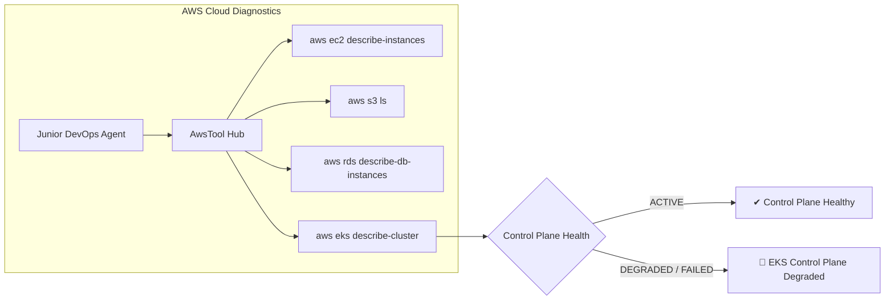

# Feature Spec 23: AWS Cloud & Amazon EKS Operations

## 1. Overview & Objective
Enterprises deploying workloads across multi-cloud environments require deep operational visibility into Amazon Web Services (AWS) infrastructure and managed Amazon Elastic Kubernetes Service (EKS) clusters. The **AWS Cloud & Amazon EKS Operations** subsystem equips the Junior DevOps Agent with structured AWS CLI integration to inspect EC2 instances, S3 buckets, RDS databases, VPCs, Lambda functions, and EKS cluster health.

## 2. Implemented Tools
Located in [`src/tools/aws.ts`](file:///Users/joshua.williams/Documents/research/devops-agent/src/tools/aws.ts):

| Tool Name | Action Tier | Description | Key Parameters |
| :--- | :--- | :--- | :--- |
| **`aws_resource_list`** | `READ` | List AWS resources across core services: EC2 instances, S3 buckets, RDS databases, VPCs, and Lambda functions. | `service?` (ec2, s3, rds, vpc, lambda), `region?` |
| **`aws_eks_status`** | `READ` | Query Amazon EKS cluster state, Kubernetes control plane version, endpoint URL, IAM role ARN, and active managed node groups. | `clusterName`, `region?` |



## 3. Data Interface & Schema
```typescript
export class AwsTool {
  static async listResources(service?: string, region?: string): Promise<string>;
  static async getEksStatus(clusterName: string, region?: string): Promise<string>;
  static async auditUnattachedEbsVolumes(region?: string): Promise<any[]>;
}
```

## 4. Multi-Cloud FinOps Integration
The `AwsTool` integrates directly into the [`FinOpsTool`](file:///Users/joshua.williams/Documents/research/devops-agent/src/tools/finops.ts):
- Scans `aws ec2 describe-volumes --filters Name=status,Values=available`
- Automatically discovers unattached AWS EBS volumes incurring idle cloud storage fees ($0.08–$0.125/GB/mo)
- Appends findings to the unified FinOps audit report.

## 5. Safety & Guardrails Enforcement
- **Tier 1 (READ):** Queries like `aws_resource_list` and `aws_eks_status` execute autonomously.
- **Tier 3 (DANGEROUS):** Catastrophic AWS mutations (e.g. `aws ec2 terminate-instances`, `aws s3 rb --force`, `aws eks delete-cluster`, `aws rds delete-db-instance`) are permanently blocked at the guardrails layer.
- **Tier 2 (MUTATE):** Non-destructive changes (e.g. updating nodegroup scaling) require human operator sign-off and Senior SRE review.
