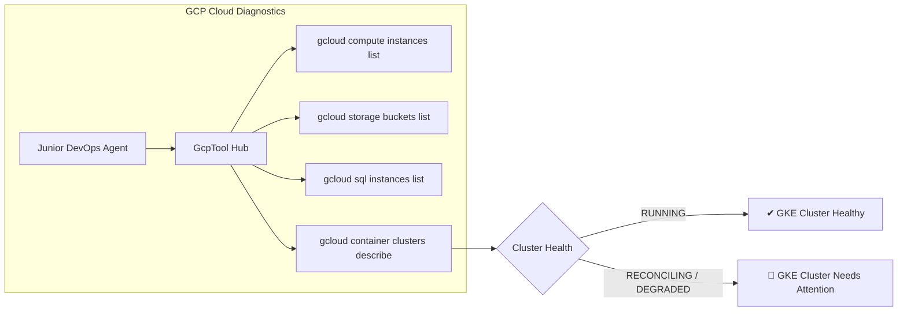

# Feature Spec 24: GCP Cloud & Google Kubernetes Engine (GKE) Operations

## 1. Overview & Objective
Google Cloud Platform (GCP) and Google Kubernetes Engine (GKE) power large-scale containerized platforms, microservices, and AI training workloads. The **GCP Cloud & Google Kubernetes Engine (GKE) Operations** subsystem provides native Google Cloud SDK (`gcloud`) integration enabling the agent to inspect Compute Engine instances, Cloud Storage buckets, Cloud SQL databases, VPC networks, and GKE cluster architectures.

## 2. Implemented Tools
Located in [`src/tools/gcp.ts`](file:///Users/joshua.williams/Documents/research/devops-agent/src/tools/gcp.ts):

| Tool Name | Action Tier | Description | Key Parameters |
| :--- | :--- | :--- | :--- |
| **`gcp_resource_list`** | `READ` | List resources in a GCP project: Compute Engine VMs, Cloud Storage buckets, Cloud SQL instances, or VPC networks. | `resourceType?` (instances, storage, sql, networks), `project?` |
| **`gcp_gke_status`** | `READ` | Query GKE cluster status, master version, node pool versions, machine types, autoscaling configuration, and API endpoint. | `clusterName`, `location?` (zone/region), `project?` |



## 3. Data Interface & Schema
```typescript
export class GcpTool {
  static async listResources(resourceType?: string, project?: string): Promise<string>;
  static async getGkeStatus(clusterName: string, location?: string, project?: string): Promise<string>;
  static async auditOrphanDisks(project?: string): Promise<any[]>;
}
```

## 4. Multi-Cloud FinOps Integration
The `GcpTool` hooks into the [`FinOpsTool`](file:///Users/joshua.williams/Documents/research/devops-agent/src/tools/finops.ts):
- Queries `gcloud compute disks list --filter="-users:*"`
- Identifies unattached Persistent Disks running in GCP projects without attached VMs
- Flags cost optimization savings directly in the unified FinOps report.

## 5. Safety & Guardrails Enforcement
- **Tier 1 (READ):** Queries like `gcp_resource_list` and `gcp_gke_status` run autonomously.
- **Tier 3 (DANGEROUS):** Destructive GCP operations (e.g. `gcloud container clusters delete`, `gcloud compute instances delete`, `gcloud projects delete`, `gcloud sql instances delete`) are permanently blocked by policy.
- **Tier 2 (MUTATE):** State mutations (such as resizing GKE node pools) require human operator confirmation and Senior SRE review.
