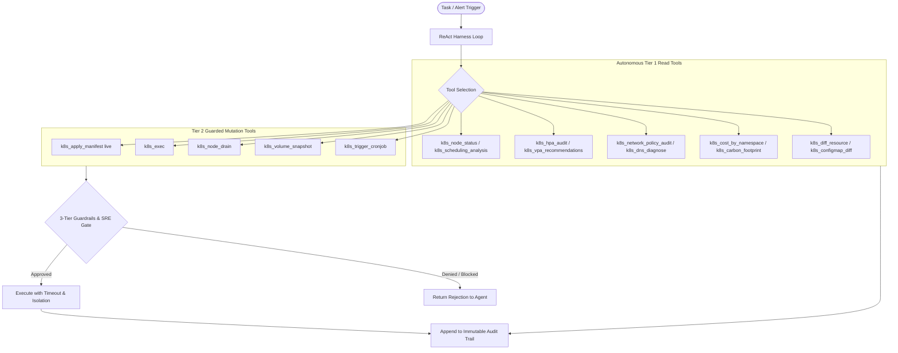

# Feature Spec 25: Enterprise Kubernetes & Containers Toolset

## 1. Overview & Objective
The **Enterprise Kubernetes & Containers Toolset** provides a comprehensive collection of 33 native, production-grade tools designed to handle every facet of Kubernetes workload lifecycle, interactive debugging, batch scheduling, autoscaling, storage resilience, network segmentation, multi-cluster federation, and FinOps/GreenOps attribution.

All tools execute with structured validation, non-zero exit code error handling, and strict integration with the agent's 3-Tier Safety Policy, human approval gates, and immutable audit ledger.

---

## 2. Functional Domains & Tool Catalog

### Domain 1: Interactive Workload Debugging
Provides non-destructive and gated interactive troubleshooting capabilities inside running workloads:
- **`k8s_exec`** (`Tier 1 / Tier 2 / Tier 3 Block`): Execute commands inside pod containers with execution timeout (default 30s) and container selection.
  - *Guardrails:* Read-only inspection commands execute autonomously in dev for Intermediate/Senior SREs. Privileged/destructive commands (`rm -rf`, `mkfs`, `dd`, `chmod 777`) are strictly blocked by Tier 3 policy. Production execution requires explicit human operator confirmation.
- **`k8s_port_forward`** (`Tier 2 Approval`): Open managed local port-forward tunnels to pods or services for temporary debugging without exposing services externally.
  - *Guardrails:* Privileged ports (< 1024) are blocked. Requires explicit port range validation and duration limits.
- **`k8s_copy`** (`Tier 2 Approval`): Safely copy files to or from pods (`kubectl cp`) to retrieve core dumps, heap dumps, or configuration files.
  - *Guardrails:* Path traversal (`../`), system credentials (`/etc/shadow`, `/etc/passwd`), and secret mounts are strictly blocked.

### Domain 2: Resource Lifecycle & Diffing
- **`k8s_diff_resource`** (`READ / Tier 1`): Generate a clean, unified diff preview between live in-cluster state and a local YAML manifest or Git-desired state.
- **`k8s_apply_manifest`** (`READ for DryRun / Tier 2 for Live`): Apply YAML manifests to the cluster. Defaults to `--dry-run=server` or `--dry-run=client` for autonomous validation; live mutations enforce human sign-off.
- **`k8s_delete_resource`** (`Tier 2 Approval / Tier 3 Block for Criticals`): Safely delete resources with dependency and cascade checks.
  - *Guardrails:* Permanently blocks deletion of `Namespace`, `Node`, and root kube-system infrastructure.
- **`k8s_wait_for_condition`** (`READ / Tier 1`): Poll a resource until a target condition is met (e.g., `condition=Ready`, `condition=Complete`) with configurable timeout (default 60s) and interval.

### Domain 3: Scheduling & Capacity
- **`k8s_node_status`** (`READ / Tier 1`): Inspect node allocatable CPU, memory, pods, taints, conditions, and drain eligibility.
- **`k8s_node_cordon`** (`Tier 2 Approval`): Mark nodes as unschedulable (`SchedulingDisabled`) before maintenance.
- **`k8s_node_uncordon`** (`Tier 2 Approval`): Restore unschedulable nodes to active service.
- **`k8s_node_drain`** (`READ for DryRun / Tier 2 for Live`): Safely evict pods with `--ignore-daemonsets`, `--delete-emptydir-data`, and PodDisruptionBudget (PDB) pre-flight checks.
- **`k8s_resource_quota_audit`** (`READ / Tier 1`): Inspect namespace `ResourceQuota` and `LimitRange` limits vs. actual consumption, highlighting exhaustion risks.
- **`k8s_scheduling_analysis`** (`READ / Tier 1`): Deep triage explaining why pods are stuck in `Pending` state (evaluating node resource pressure, taints/tolerations, node selectors, and pod affinity).

### Domain 4: Autoscaling & Resilience
- **`k8s_hpa_status` / `k8s_hpa_audit`** (`READ / Tier 1`): Audit Horizontal Pod Autoscaler metrics, current vs. target replicas, scaling thresholds, and min/max saturation bounds.
- **`k8s_vpa_recommendations`** (`READ / Tier 1`): Query Vertical Pod Autoscaler recommendations for right-sizing CPU and memory requests/limits.
- **`k8s_pdb_audit`** (`READ / Tier 1`): Audit PodDisruptionBudget coverage across workloads to detect vulnerable single points of failure.
- **`k8s_disruption_budget_check`** (`READ / Tier 1`): Pre-flight simulation validating whether a workload rollout or node drain would violate active PDBs.

### Domain 5: Storage & Persistent Data
- **`k8s_pvc_analysis`** (`READ / Tier 1`): Inspect PVC utilization, volume binding modes, access modes, storage classes, and snapshot support.
- **`k8s_pv_cleanup`** (`READ for DryRun / Tier 2 for Live`): Discover `Released` or `Failed` orphaned PersistentVolumes and propose reclamation.
- **`k8s_volume_snapshot`** (`Tier 2 Approval`): Trigger native Kubernetes CSI `VolumeSnapshot` before risky workload or database mutations.

### Domain 6: Batch Workloads
- **`k8s_job_status`** (`READ / Tier 1`): Audit batch Job completions, active/failed pods, durations, and backoff limits.
- **`k8s_cronjob_status`** (`READ / Tier 1`): Audit CronJob schedules, last schedule times, active jobs, and suspend states.
- **`k8s_trigger_cronjob`** (`Tier 2 Approval`): Trigger manual execution of a CronJob as a one-off batch Job with bounded timeout.

### Domain 7: Configuration & Secrets Management
- **`k8s_configmap_diff`** (`READ / Tier 1`): Compare ConfigMap key-value pairs across namespaces or against local Git manifests.
- **`k8s_secret_rotate_check`** (`READ / Tier 1`): Audit secret creation timestamps and flag unrotated secrets older than policy threshold (e.g. 90 days), with zero value exposure.
- **`k8s_env_injection_audit`** (`READ / Tier 1`): Audit environment variables across workloads, detecting raw hardcoded credentials vs. secret/configmap references.

### Domain 8: Networking & Policy
- **`k8s_network_policy_audit`** (`READ / Tier 1`): Audit cluster NetworkPolicies for Zero-Trust compliance, identifying unisolated pods and overly broad ingress/egress rules.
- **`k8s_ingress_check`** (`READ / Tier 1`): Audit Ingress objects, TLS certificate termination, routing rules, and upstream service availability.
- **`k8s_service_endpoints`** (`READ / Tier 1`): Diagnose Service selector matching, verifying healthy Endpoints and EndpointSlices.
- **`k8s_dns_diagnose`** (`READ / Tier 1`): Perform deep in-cluster DNS diagnostics, testing CoreDNS pod status, upstream forwarders, and latency.

### Domain 9: Multi-Cluster, GitOps & FinOps
- **`k8s_multi_cluster_inventory`** (`READ / Tier 1`): Aggregate workloads, nodes, and cluster health across all configured kubeconfig contexts.
- **`k8s_cluster_comparison`** (`READ / Tier 1`): Compare and diff workloads between two clusters (e.g. staging vs. production).
- **`k8s_git_sync_status`** (`READ / Tier 1`): Check synchronization drift between live cluster state and a Git repository.
- **`k8s_cost_by_namespace`** (`READ / Tier 1`): Estimate monthly cloud cost allocation broken down by namespace and workload based on CPU/RAM requests.
- **`k8s_carbon_footprint`** (`READ / Tier 1`): Estimate operational carbon footprint (kg CO2e) and power consumption based on node CPU architectures and regional grid carbon intensity.

---

## 3. Architecture & Execution Flow

---

## 4. Safety Guardrails & Access Control
1. **Destructive Command Blocking:** Shell execution inside `k8s_exec` strictly blocks commands matching high-risk signatures (`rm -rf /`, `mkfs`, `fdisk`, `:(){ :|:& };:`, raw disk writes).
2. **Path Traversal Protection:** `k8s_copy` strictly rejects `..` path segments and sensitive system credential locations (`/etc/shadow`, `/etc/passwd`, `/proc/kcore`).
3. **Privileged Port Restrictions:** `k8s_port_forward` forbids ports below 1024 to prevent hijacking system services.
4. **Critical Resource Immunity:** Deletion of `Namespace`, `Node`, `ClusterRole`, or resources in `kube-system` is permanently blocked.

---

## 5. Verification & Tests
Verified in [`test/smoke.test.ts`](file:///Users/joshuawilliams/Documents/Research/devops-agent/test/smoke.test.ts):
- Tests 34–94: Comprehensive validation of all 33 tools across read-only autonomy, dry-run evaluation, live approval enforcement, and policy rejection.
