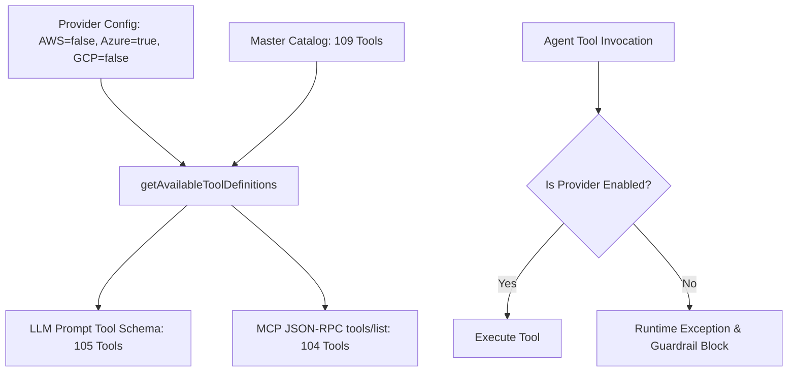

# Feature Spec 26: Cloud Provider Toggles & Strict Kubeconfig Grounding

## 1. Overview & Objective
Enterprises frequently require strict operational boundaries:
1. **Multi-Cloud Isolation:** Operators must be able to turn specific cloud providers (`AWS`, `Azure`, `GCP`) on or off, ensuring the agent never attempts to query or mutate cloud infrastructure outside the organization's sanctioned scope.
2. **Kubernetes-Only Grounding:** In Kubernetes-only environments (bare metal, on-premises, k3s, Kind, or locked-down multi-tenant clusters), the agent must stick strictly to the active `kubeconfig` context and be completely blocked from using cloud provider CLIs or credentials wrapper commands (`aws eks update-kubeconfig`, `az aks get-credentials`, `gcloud container clusters get-credentials`) that cause credentials or cluster drift.

---

## 2. Configuration & Runtime Architecture

### Configuration Knobs
- **Environment Variables (`.env`):**
  ```bash
  ENABLE_AWS=true|false
  ENABLE_AZURE=true|false
  ENABLE_GCP=true|false
  STICK_TO_KUBECONFIG=true|false
  KUBECONFIG=sb-config                  # Optional custom kubeconfig path
  ```
- **CLI Startup Flags:**
  ```bash
  --kubeconfig=sb-config               # Target specific kubeconfig file (just like kubectl --kubeconfig=sb-config)
  --no-aws, --no-azure, --no-gcp
  --aws=true|false, --azure=true|false, --gcp=true|false
  --k8s-only                           # Disables AWS, Azure, and GCP simultaneously
  --stick-to-kubeconfig, --no-stick-to-kubeconfig
  ```
- **Interactive REPL Commands:**
  ```bash
  /kubeconfig                          # Show active kubeconfig file, existence, and available contexts
  /kubeconfig sb-config                # Switch active kubeconfig dynamically
  /kubeconfig reset                    # Reset to default ~/.kube/config
  /cloud                               # Show active provider and grounding status
  /providers                           # Alias for /cloud
  /cloud aws off                       # Disable AWS dynamically
  /cloud azure on                      # Enable Azure dynamically
  /cloud stick on                      # Enforce strict in-cluster kubeconfig grounding
  /k8s-only                            # Instantly disable all cloud providers and ground to kubeconfig
  ```
- **REST Webhook API:**
  - `GET /api/config/providers` -> Returns active cloud providers, active kubeconfig path, grounding status, and tool counts.
  - `POST /api/config/providers` -> Dynamically updates `{ kubeconfig?: string, aws?: boolean, azure?: boolean, gcp?: boolean, stickToKubeConfig?: boolean }`.

---

## 3. Dynamic Tool Catalog Filtering

The agent maintains **109 platform tools** in its master catalog. When cloud providers are toggled, [`getAvailableToolDefinitions(context)`](file:///Users/joshuawilliams/Documents/Research/devops-agent/src/tools/index.ts) dynamically filters the tool catalog before sending definitions to LLMs or publishing via the MCP server:

| Configuration State | Disabled Tools | Active Tool Catalog Size |
| :--- | :--- | :--- |
| **All Cloud Providers Enabled** | None | **109 tools** |
| **AWS Disabled** (`--no-aws`) | `aws_resource_list`, `aws_eks_status` | **107 tools** |
| **Azure Disabled** (`--no-azure`) | `az_resource_list`, `az_aks_status` | **107 tools** |
| **GCP Disabled** (`--no-gcp`) | `gcp_resource_list`, `gcp_gke_status` | **107 tools** |
| **Kubernetes-Only Mode** (`--k8s-only`) | All 6 cloud provider tools | **103 tools** |

Multi-provider tools like `cloud_db_snapshot` remain accessible if at least one cloud provider is active, but selectively block arguments corresponding to disabled providers.



---

## 4. Multi-Tier Guardrail Enforcement

Located in [`src/policy/guardrails.ts`](file:///Users/joshuawilliams/Documents/Research/devops-agent/src/policy/guardrails.ts):

### 1. Disabled Cloud Tool Execution
Attempting to invoke an explicit cloud tool (e.g. `aws_resource_list` when AWS is false) results in an immediate **BLOCKED** evaluation by the policy engine, and throws an explicit `Error` in `executeTool`.

### 2. Disabled Cloud Shell CLI Commands
Attempting to run raw shell commands matching disabled cloud provider binaries (e.g., `aws s3 ls`, `az group list`, `gcloud compute instances list`) is intercepted and blocked:
```
Blocked by policy: AWS cloud provider is disabled in current agent configuration.
```

### 3. Strict Kubeconfig Grounding (`stickToKubeConfig: true`)
When `stickToKubeConfig` is active, the agent is strictly prohibited from running credentials-switching wrappers that alter the cluster context:
- `aws eks update-kubeconfig`
- `az aks get-credentials`
- `gcloud container clusters get-credentials`

Native in-cluster commands (`kubectl get pods`, `helm list`, `k9s`) remain fully permitted and grounded in the currently active context.

---

## 5. Web Mission Control Integration

The Mission Control dashboard (`http://localhost:3456/dashboard`) includes a dedicated **Cloud Provider Pill** in the top navigation bar:
- Displays `AWS • AZ • GCP` when all are enabled, or `K8S ONLY` in Kubernetes-only mode.
- Clicking the pill opens an interactive dropdown menu with live toggles for AWS, Azure, GCP, and Stick to Kubeconfig.
- Includes a 1-click **"Activate Kubernetes-Only Mode"** button that immediately locks down the agent to in-cluster diagnostics.

---

## 6. Verification & Test Suite

Validated in [`test/cloud_provider.test.ts`](file:///Users/joshuawilliams/Documents/Research/devops-agent/test/cloud_provider.test.ts) and [`test/smoke.test.ts`](file:///Users/joshuawilliams/Documents/Research/devops-agent/test/smoke.test.ts):
- Tool catalog dynamic sizing from 108 to 102 tools.
- Guardrail blocking of disabled cloud tools and shell CLIs.
- Guardrail blocking of cloud credentials wrapper commands.
- Permitted execution of native in-cluster commands.
- MCP server `tools/list` dynamic filtering.
- REST API toggle endpoints.
