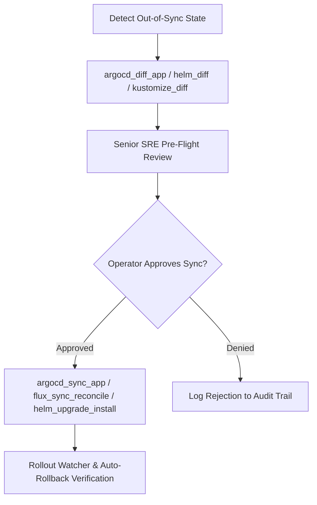

# Feature Spec 27: GitOps (Argo CD & Flux v2), Helm, Kustomize, and Terraform IaC

## 1. Overview & Objective
Modern enterprise DevOps teams rely heavily on declarative Infrastructure as Code (IaC) and GitOps synchronization engines. The **GitOps & IaC Subsystem** gives the agent first-class tooling to inspect, plan, diff, validate, and safely apply changes across Terraform/OpenTofu, Helm charts, Kustomize overlays, Argo CD, and Flux v2.

---

## 2. Tool Catalog & Capabilities

### Infrastructure as Code (Terraform & OpenTofu)
- **`terraform_plan`** (`READ / Tier 1`): Run `terraform plan` or OpenTofu plan to inspect proposed cloud additions, changes, and destructions with detailed summary.
- **`terraform_apply`** (`Tier 2 Approval`): Apply a previously generated or validated plan. Strictly guarded with production approval requirements.
- **`terraform_drift_detect`** (`READ / Tier 1`): Query live infrastructure status against declared state files without making mutations.
- **`terraform_state_inspect`** (`READ / Tier 1`): Inspect state resource listings, outputs, and module details without revealing raw sensitive values.
- **`terraform_workspace_manage`** (`READ for list / Tier 2 for select/new`): Inspect active workspaces, list workspaces, or switch environment targets.

### Package & Manifest Management (Helm & Kustomize)
- **`helm_template`** (`READ / Tier 1`): Render Helm chart templates locally without cluster contact to verify generated Kubernetes manifests.
- **`helm_values_get`** (`READ / Tier 1`): Inspect active user-supplied or computed values from a deployed Helm release.
- **`helm_lint`** (`READ / Tier 1`): Run `helm lint` against local chart directories to validate YAML syntax and variable definitions.
- **`helm_diff`** (`READ / Tier 1`): Generate a visual unified diff of what a proposed Helm release upgrade would modify prior to execution.
- **`helm_upgrade_install`** (`READ for DryRun / Tier 2 for Live`): Install or upgrade a Helm release. Dry-run mode executes autonomously; live installation requires human sign-off.
- **`helm_status`** (`READ / Tier 1`): Query release status, revision, chart version, and resource health.
- **`helm_history`** (`READ / Tier 1`): List historical release revisions and deployment descriptions.
- **`helm_rollback`** (`Tier 2 Approval`): Roll back a degraded Helm release to a known healthy revision.
- **`kustomize_build`** (`READ / Tier 1`): Render Kustomize manifests from an overlay or base directory into compiled YAML.
- **`kustomize_diff`** (`READ / Tier 1`): Compare two Kustomize targets (e.g. base vs. overlay or dev vs. prod) and output a unified diff.

### GitOps Engines (Argo CD & Flux v2)
- **`argocd_app_status`** (`READ / Tier 1`): Inspect sync status (`Synced`/`OutOfSync`) and health status (`Healthy`/`Degraded`) of Argo CD applications.
- **`argocd_diff_app`** (`READ / Tier 1`): Inspect live cluster manifest drift against Git repository source of truth.
- **`argocd_sync_app`** (`Tier 2 Approval`): Trigger manual or automated synchronization of an Argo CD application.
- **`argocd_app_rollback`** (`Tier 2 Approval`): Roll back an Argo CD application to a previous deployment revision.
- **`flux_app_status`** (`READ / Tier 1`): Query Flux v2 sync status across `Kustomization`, `HelmRelease`, and `GitRepository` CRDs.
- **`flux_sync_reconcile`** (`Tier 2 Approval`): Trigger an immediate reconciliation on a Flux CD resource to bypass polling intervals.

### CI/CD Pipeline Verification
- **`gitops_verify_pr_checks`** (`READ / Tier 1`): Inspect GitHub/GitLab Pull Request CI statuses, required checks, and merge readiness.
- **`ci_pipeline_logs`** (`READ / Tier 1`): Retrieve failed CI/CD workflow logs, job steps, and error stack traces.
- **`ci_rerun_failed`** (`Tier 2 Approval`): Re-trigger failed CI/CD pipeline jobs after automated fixes.

---

## 3. Workflow Architecture

---

## 4. Verification & Tests
Verified in [`test/smoke.test.ts`](file:///Users/joshuawilliams/Documents/Research/devops-agent/test/smoke.test.ts):
- Tests 20–33 validate Terraform, Helm, Kustomize, Argo CD, and Flux v2 tool execution, dry-run safety, and approval gating.
