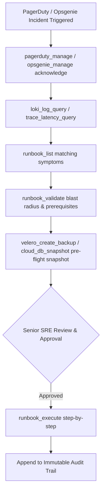

# Feature Spec 28: SRE Runbooks, Vault & Secrets, Service Mesh, and Observability

## 1. Overview & Objective
Enterprise Site Reliability Engineering requires standardized operational procedures, deep secret lifecycle auditing without credential leakage, service mesh proxy diagnostics, automated disaster recovery verification, and real-time observability integration.

This subsystem equips the agent with high-reliability tooling for runbook execution, secrets compliance, mesh traffic tracing, centralized logging, and on-call paging operations.

---

## 2. Tool Catalog & Capabilities

### Vetted SRE Runbooks
- **`runbook_list`** (`READ / Tier 1`): List available enterprise SRE runbooks matching optional symptoms or service names.
- **`runbook_validate`** (`READ / Tier 1`): Pre-flight validation of runbook prerequisites, parameters, target workloads, and blast radius before execution.
- **`runbook_execute`** (`Tier 2 Approval`): Execute a vetted SRE runbook step-by-step with automated checkpoints and rollback triggers.

### Secrets Management & Admission Control
- **`vault_secret_inspect`** (`READ / Tier 1`): Safely audit secret metadata, lease durations, TTLs, and rotation dates across HashiCorp Vault, AWS Secrets Manager, Azure Key Vault, or native Kubernetes Secrets without leaking sensitive values.
- **`sealed_secrets_check`** (`READ / Tier 1`): Audit Bitnami `SealedSecrets` decryption status, certificate expiration, and synchronization health.
- **`external_secrets_check`** (`READ / Tier 1`): Audit External Secrets Operator (ESO) `ExternalSecret` and `SecretStore` status, sync conditions, and backend provider connectivity.
- **`k8s_policy_audit`** (`READ / Tier 1`): Audit live Kubernetes admission control policy compliance (Kyverno, OPA Gatekeeper, Pod Security Standards).

### Service Mesh Diagnostics (Istio & Linkerd)
- **`service_mesh_diagnose`** (`READ / Tier 1`): Inspect service mesh sidecar proxy synchronization (Envoy CDS, LDS, RDS, EDS), detect config sync lag, verify mutual TLS (mTLS) enforcement, and surface proxy communication errors.

### Disaster Recovery & Database Snapshots
- **`velero_backup_check`** (`READ / Tier 1`): Audit Kubernetes cluster backup health using Velero, verifying scheduled backups, completion rates, and snapshot freshness.
- **`velero_create_backup`** (`Tier 2 Approval`): Create an on-demand Velero backup snapshot prior to performing high-risk maintenance or cluster upgrades.
- **`cloud_db_snapshot`** (`Tier 2 Approval`): Trigger an on-demand point-in-time snapshot for AWS RDS, Azure Database for MySQL/PostgreSQL, or GCP Cloud SQL before data migrations.

### Observability & Incident Response
- **`loki_log_query`** (`READ / Tier 1`): Query centralized multi-service logs across the cluster using Grafana Loki LogQL.
- **`trace_latency_query`** (`READ / Tier 1`): Query distributed traces from Jaeger, Tempo, or OpenTelemetry to pinpoint latency bottlenecks across microservices.
- **`pagerduty_manage`** (`READ for list / Tier 2 for ack/resolve`): List triggered alerts, acknowledge incidents, add notes, or mark incidents resolved.
- **`opsgenie_manage`** (`READ for list / Tier 2 for ack/close`): Manage Opsgenie on-call alerts, acknowledging, escalating, or closing alerts.

---

## 3. Workflow Architecture

---

## 4. Verification & Tests
Verified in [`test/smoke.test.ts`](file:///Users/joshuawilliams/Documents/Research/devops-agent/test/smoke.test.ts):
- Tests 14–19, 21–25 validate runbook lifecycle, Vault and secrets auditing, service mesh diagnostics, Velero backups, and observability queries.
