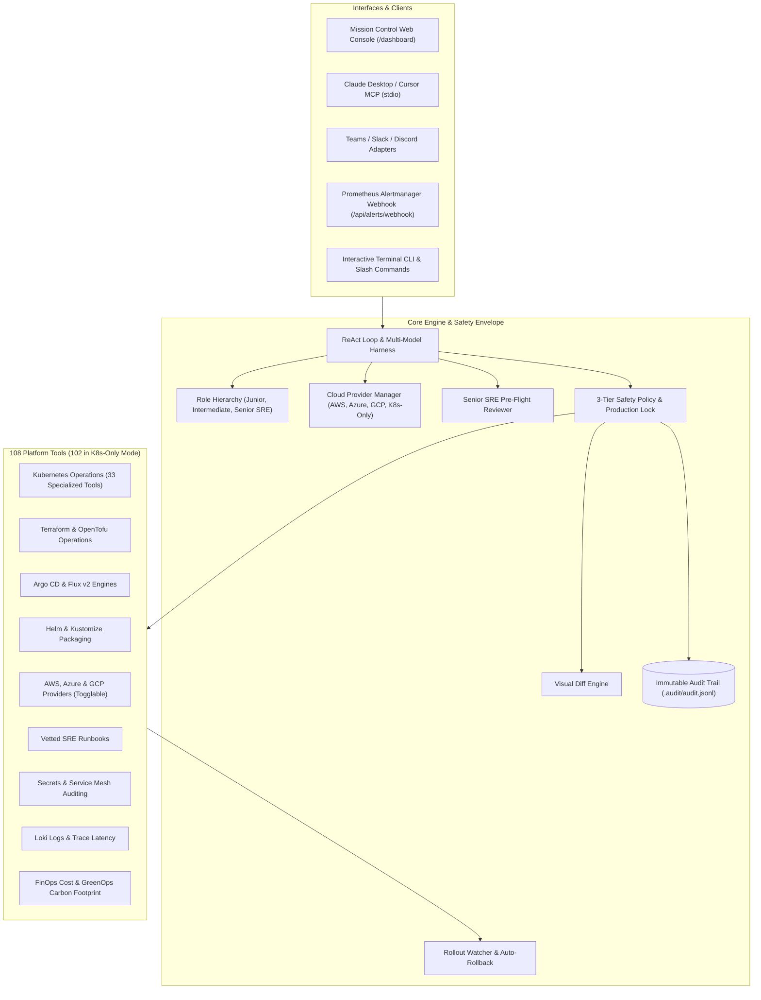

# DevOps Autonomous Agent Engine — Feature Specifications Index

Welcome to the comprehensive technical specification catalog for the **DevOps Autonomous Agent Engine (v4.5)**. This directory contains detailed, production-grade architecture and design specifications (`.md`) for every capability across our **108 platform tools**, multi-tier safety envelope, and multi-cloud isolation architecture.

---

## 📑 Feature Specification Catalog

### Part I: Core Agent Engine & Safety Envelope
- **[Spec 01: Progressive Safety Guardrails & 3-Tier Policy](file:///Users/joshuawilliams/Documents/Research/devops-agent/docs/specs/01-safety-guardrails-and-policy.md)**
  *Three-tier deterministic policy (READ autonomous, MUTATE operator confirmation, DANGEROUS permanently blocked), Environment-Aware Production Lock, and approval handlers.*
- **[Spec 02: Visual Unified Diff Engine](file:///Users/joshuawilliams/Documents/Research/devops-agent/docs/specs/02-visual-diff-engine.md)**
  *ANSI color-coded visual unified diff generator for manifests, config drifts, and file changes.*
- **[Spec 03: Immutable Audit Logging System](file:///Users/joshuawilliams/Documents/Research/devops-agent/docs/specs/03-immutable-audit-logging.md)**
  *Append-only JSON Lines ledger (`.audit/audit.jsonl`), UUID session correlation, and REST forensics API.*
- **[Spec 04: Rollout Watcher & Automated Rollback](file:///Users/joshuawilliams/Documents/Research/devops-agent/docs/specs/04-rollout-watcher-and-auto-rollback.md)**
  *Autonomous post-mutation workload monitoring with instant `kubectl rollout undo` on crash/timeout.*
- **[Spec 05: Senior SRE Pre-Flight Reviewer (Dual-Agent)](file:///Users/joshuawilliams/Documents/Research/devops-agent/docs/specs/05-senior-sre-reviewer.md)**
  *Multi-agent architecture with pre-flight architectural critiques, risk levels, and blast-radius analysis.*
- **[Spec 06: ReAct Agent Loop & LLM Harness](file:///Users/joshuawilliams/Documents/Research/devops-agent/docs/specs/06-react-agent-loop-and-llm-harness.md)**
  *ReAct multi-turn autonomous reasoning loop, multi-provider LLM support (Gemini, OpenAI, Kimi, Claude, Ollama), corporate proxy tunneling, and offline diagnostic fallback.*

---

### Part II: Multi-Cloud, Federation & Isolation
- **[Spec 08: Azure Cloud & AKS Operations](file:///Users/joshuawilliams/Documents/Research/devops-agent/docs/specs/08-azure-cloud-and-aks-operations.md)**
  *Azure Resource Manager queries, AKS provisioning state, power state, and node pool health.*
- **[Spec 23: AWS Cloud & Amazon EKS Operations](file:///Users/joshuawilliams/Documents/Research/devops-agent/docs/specs/23-aws-cloud-and-eks-operations.md)**
  *AWS resource queries (EC2, S3, RDS, VPC, Lambda), EKS cluster health, and unattached EBS volume waste audit.*
- **[Spec 24: GCP Cloud & Google Kubernetes Engine (GKE) Operations](file:///Users/joshuawilliams/Documents/Research/devops-agent/docs/specs/24-gcp-cloud-and-gke-operations.md)**
  *GCP resource queries (GCE, Cloud Storage, Cloud SQL, VPC), GKE cluster health, and unattached persistent disk audit.*
- **[Spec 26: Cloud Provider Toggles & Strict Kubeconfig Grounding](file:///Users/joshuawilliams/Documents/Research/devops-agent/docs/specs/26-cloud-provider-toggles-and-kubeconfig-grounding.md)**
  *Dynamic runtime cloud toggles (`AWS`, `Azure`, `GCP`), tool filtering (108 to 102 tools in `--k8s-only` mode), and strict guardrails preventing credentials wrapper overrides.*

---

### Part III: Kubernetes & Container Orchestration
- **[Spec 07: Kubernetes Cluster Operations](file:///Users/joshuawilliams/Documents/Research/devops-agent/docs/specs/07-kubernetes-cluster-operations.md)**
  *Resource queries (`-A`), describe, pod previous crash logs (`logs -p`), and workload restarts.*
- **[Spec 25: Enterprise Kubernetes & Containers Toolset](file:///Users/joshuawilliams/Documents/Research/devops-agent/docs/specs/25-enterprise-kubernetes-and-containers-toolset.md)**
  *33 specialized tools covering Interactive Debugging (`k8s_exec`, `k8s_port_forward`, `k8s_copy`), Resource Lifecycle, Scheduling, Autoscaling, Persistent Storage, Batch, Networking, and GreenOps.*
- **[Spec 15: In-Cluster Network Connectivity Prober](file:///Users/joshuawilliams/Documents/Research/devops-agent/docs/specs/15-in-cluster-network-connectivity-prober.md)**
  *CoreDNS resolution checks, TCP socket reachability, and network latency instrumentation.*
- **[Spec 19: Ephemeral Docker Sandbox Runner](file:///Users/joshuawilliams/Documents/Research/devops-agent/docs/specs/19-ephemeral-docker-sandbox.md)**
  *Disposable container execution with CPU/memory caps, isolated filesystems, and host fallback.*

---

### Part IV: GitOps, Helm, Manifests & Infrastructure as Code
- **[Spec 09: GitOps Pull Request Automation](file:///Users/joshuawilliams/Documents/Research/devops-agent/docs/specs/09-gitops-pull-request-automation.md)**
  *Automated branch creation, manifest commit synthesis, and Pull Request opening to prevent cluster drift.*
- **[Spec 27: GitOps (Argo CD & Flux v2), Helm, Kustomize, and Terraform IaC](file:///Users/joshuawilliams/Documents/Research/devops-agent/docs/specs/27-gitops-helm-flux-argocd-and-terraform-iac.md)**
  *Declarative GitOps and IaC operations covering Terraform plans/state/drift, Helm package lifecycle, Kustomize overlays, and Argo CD/Flux synchronization.*
- **[Spec 11: Security & Manifest Static Linter](file:///Users/joshuawilliams/Documents/Research/devops-agent/docs/specs/11-security-and-manifest-static-linter.md)**
  *Static analysis for privileged containers, root users, `:latest` tags, and missing CPU/memory limits.*

---

### Part V: Reliability, Incident Response & Runbooks
- **[Spec 10: Incident Postmortems & Knowledge Base Memory](file:///Users/joshuawilliams/Documents/Research/devops-agent/docs/specs/10-incident-postmortems-and-knowledge-base.md)**
  *Structured Root Cause Analysis (RCA) generation, `.postmortems/` export, and searchable organizational memory.*
- **[Spec 18: Semantic Vector Incident Memory Search](file:///Users/joshuawilliams/Documents/Research/devops-agent/docs/specs/18-semantic-vector-incident-memory.md)**
  *Vector embedding and cosine similarity search across historical incidents for conceptual symptom matching.*
- **[Spec 14: Service Dependency Topology & Blast-Radius Mapping](file:///Users/joshuawilliams/Documents/Research/devops-agent/docs/specs/14-service-dependency-topology-and-blast-radius.md)**
  *Ingress-to-Service-to-Pod graph discovery, Mermaid diagram synthesis, and architectural dependency mapping.*
- **[Spec 16: Automated Canary Release Pipeline](file:///Users/joshuawilliams/Documents/Research/devops-agent/docs/specs/16-automated-canary-release-pipeline.md)**
  *Progressive traffic-shifted stepping (10% -> 25% -> 50% -> 100%), error rate monitoring, and auto-rollback.*
- **[Spec 17: Chaos Engineering Drill Engine](file:///Users/joshuawilliams/Documents/Research/devops-agent/docs/specs/17-chaos-engineering-drill-engine.md)**
  *Controlled pod termination, latency injection, and production safety interlocking.*
- **[Spec 28: SRE Runbooks, Vault & Secrets, Service Mesh, and Observability](file:///Users/joshuawilliams/Documents/Research/devops-agent/docs/specs/28-sre-runbooks-vault-secrets-and-observability.md)**
  *Vetted operational runbooks, secrets compliance, Istio/Linkerd mTLS diagnostics, Velero backups, and Loki/Jaeger telemetry.*

---

### Part VI: FinOps, GreenOps & Governance
- **[Spec 12: TLS Certificate Sentinel & Expiry Checker](file:///Users/joshuawilliams/Documents/Research/devops-agent/docs/specs/12-tls-certificate-sentinel.md)**
  *In-cluster TLS secret scanner, X.509 validity inspection, negative-days tracking, and hostname probing.*
- **[Spec 13: FinOps Waste & Idle Cloud Resource Hunter](file:///Users/joshuawilliams/Documents/Research/devops-agent/docs/specs/13-finops-waste-and-idle-resource-hunter.md)**
  *Unattached PVC discovery, idle LoadBalancer service auditing, and orphaned cloud volume tracking.*

---

### Part VII: Extensibility, Integrations & Interfaces
- **[Spec 20: Model Context Protocol (MCP) Server & Client Hub](file:///Users/joshuawilliams/Documents/Research/devops-agent/docs/specs/20-model-context-protocol-mcp.md)**
  *MCP JSON-RPC 2.0 stdio server exposing platform tools to Claude Desktop, Cursor, and Antigravity IDE.*
- **[Spec 21: Enterprise ChatOps Notification Adapters](file:///Users/joshuawilliams/Documents/Research/devops-agent/docs/specs/21-chatops-notification-adapters.md)**
  *Interactive card and message builders for Microsoft Teams Adaptive Cards, Slack Block Kit, and Discord Rich Embeds.*
- **[Spec 22: Mission Control Web Console & Alert Webhook Server](file:///Users/joshuawilliams/Documents/Research/devops-agent/docs/specs/22-mission-control-web-console.md)**
  *Web console on port 3456 (`/dashboard`), Alertmanager webhook receiver (`/api/alerts/webhook`), audit trail viewer, and live cloud provider toggles.*

---

## 🏛️ System Architecture Map



---

## 🧪 Verification & Test Suite
Every feature specified above is backed by automated tests in [`test/smoke.test.ts`](file:///Users/joshuawilliams/Documents/Research/devops-agent/test/smoke.test.ts) and [`test/cloud_provider.test.ts`](file:///Users/joshuawilliams/Documents/Research/devops-agent/test/cloud_provider.test.ts):
```bash
npm run build && npm test
```
